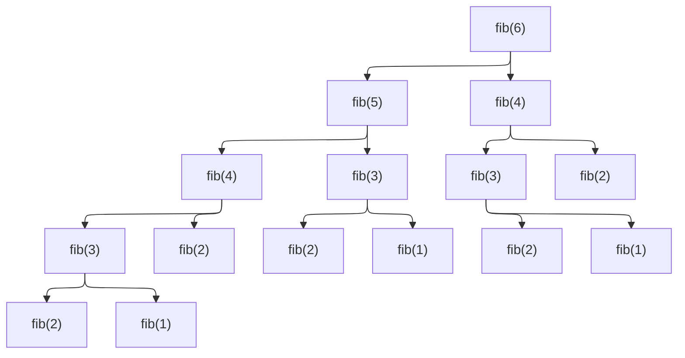
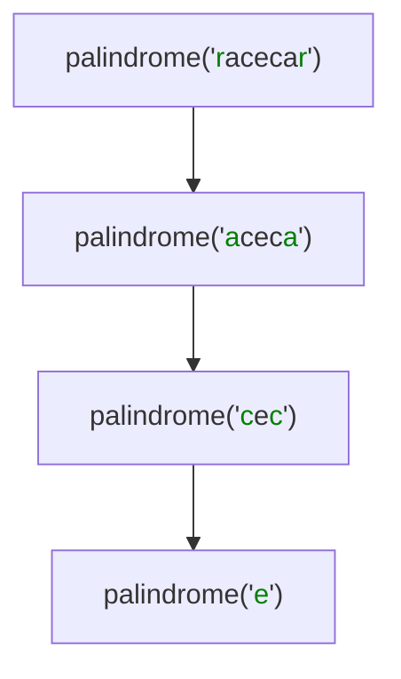

```mdx-code-block
import CodeBlock from '@theme/CodeBlock';
import Tabs from '@theme/Tabs';
import TabItem from '@theme/TabItem';
```

## Iteration
The iterative strategy consists in using loops (e.g. for, while)
to repeat a process until a condition is met. Each step in a loop
is called an iteration. It’s great for running through an input and
applying the same operations on every part of it

## Power Set
If you have a set $S={a,b,c}$, the power set contains every possible combination of those elements, including the empty set and the set itself:

Power Set of ${a,b,c}: {\emptyset,{a},{b},{c},{a,b},{a,c},{b,c},{a,b,c}}$

The size of a power set is always 2^n, where n is the number of elements in the original set.

In algorithm design

* Generating a power set is a fundamental problem in "Combinatorial Generation"—the process of systematically visiting every possible configuration of a set.
* the power set is the "foundation" of Brute Force strategies.
* If you are trying to solve the Knapsack Problem or the Traveling Salesperson Problem by checking every single possible answer to find the best one, you are essentially generating a power set (or a permutation) and testing each subset.

## Recursion
Recursion is a technique where an algorithm solves a problem by:

* Solving smaller instances of the same problem
* Combining their results
* Stopping at a base case

Formally: A recursive algorithm defines the solution in terms of itself on smaller inputs. This mirrors mathematical induction and many problem structures in CS.

We say there’s recursion when a function delegates work to clones
of itself. A recursive algorithm will naturally come to mind for
solving a problem defined in terms of itself. For example, take
the famous Fibonacci sequence.

Using recursion requires creativity for seeing how a problem can be stated in terms of itself.

Recursion is:

* A problem-solving lens
* A bridge between math and code
* The natural language of algorithm design

Algorithm strategies (Divide & Conquer, DP, Backtracking, etc.) are essentially structured ways of using recursion effectively.

Recursive algorithms have base cases, when the input is too small
to be further reduced. Base cases for fib are numbers 1 and 2; for
palindrome, they’re words with one or zero characters.

For example, take
the famous Fibonacci sequence. It starts with two ones, and
each subsequent number is the sum of the two previous numbers:
1, 1, 2, 3, 5, 8, 13, 21, … How do you code a function that returns
the nth Fibonnacci number?
```
function fib(n)
    if n ≤2
        return n
    return fib(n -1 ) + fib(n -2 )
```

<!--```
               [ fib(6) ]
               /        \
              /          \
        [ fib(5) ]    [ fib(4) ]
        /      \        /      \
  [ fib(4) ] [ fib(3) ] [ fib(3) ] [ fib(2) ]
    /    \     /    \     /    \
[ fib(3) ][ fib(2) ][ fib(2) ][ fib(1) ][ fib(2) ][ fib(1) ]
  /    \
[ fib(2) ][ fib(1) ]
```-->


Example: Checking if a word is palindrome3 is checking if the word changes if it’s reversed. But also a word is
palindrome if its first and last characters are equal and the sub-
word between those characters is a palindrome:
```
function palindrome(word)
    if word.length ≤1
        return True
    if word.first_char ≠ word.last_char
        return False
    w ← word.remove_first_and_last_chars
    return palindrome(w)
```
**Checking if "racecar" is palindrome recursively**


**Core components of any recursive algorithm**

Every correct recursive algorithm has:

1. Base case
   * The smallest input that can be solved directly
   * Prevents infinite recursion
2. Recursive case
   * The problem reduced to smaller subproblems
3. Progress toward the base case
   * Each recursive call must move closer to termination

If any of these are missing → the algorithm is incorrect.

**Role in Algorithm Design Strategies**

Many problems are naturally recursive:

* Tree traversal
* Graph exploration
* Divide-and-conquer problems
* Dynamic programming recurrences

Trying to force these into purely iterative logic often:

* Obscures the idea
* Makes correctness harder to reason about

Recursion gives you clarity first, optimization second.

Recursion is the engine behind several major algorithm design paradigms. Each uses recursion differently to manage the "flow" of problem-solving.

1. Divide and Conquer

   Recursion is the heart of the Divide and Conquer strategy. It works by breaking a problem into smaller "sub-problems" that look exactly like the original, solving those, and then combining the results. This strategy splits a problem into independent sub-problems, solves them recursively, and then combines the results.

   Without recursion, divide-and-conquer loses its conceptual simplicity.

   Each recursive call represents one level of decision.

   * How it uses recursion: It creates a "branching" effect where the problem size is reduced significantly at each step (often halved).
   * Pattern:
     * Divide problem into subproblems
     * Solve subproblems recursively
     * Combine results
   * Examples:
     * Sorting: Algorithms like Merge Sort and Quick Sort use recursion to split lists until they are single elements, then stitch them back together in order.
       * Merge Sort: Divides an array until it reaches 1-element subarrays, then merges them back in order.
       * Quick Sort
     * Searching: Binary Search recursively discards half of the data set at each step to find a target in O(logn) time.
       * Binary Search: Discards half of the searchable data at each recursive step.
     * Strassen’s Matrix Multiplication
2. Greedy Algorithms
   * Recursion is optional but often helpful.
   * Example:
     * Activity selection (recursive version)
     * Huffman coding tree construction
   * Greedy logic chooses locally optimal steps; recursion structures the solution.
3. Backtracking

   Backtracking is used for problems where you need to explore all possible configurations or paths to find a solution.

   Recursion models decision trees.
   * Pattern:
     * Choose
     * Explore recursively
     * Undo choice
   * How it uses recursion: It builds a solution incrementally. If the current "path" fails a constraint, the function "returns" (backtracks) to the previous state to try a different path.
   * Examples:
     * N-Queens Problem: Placing queens on a board and backtracking if two queens attack each other.
     * Sudoku Solvers: Filling cells and undoing choices that lead to a dead end.
     * Permutations and combinations
     * Subset generation
4. Dynamic Programming (Top-Down)

   When sub-problems are not independent (they overlap), simple recursion becomes inefficient. Dynamic Programming uses recursion with Memoization.

   * Recursion expresses the recurrence relation.
   * Top-Down DP:
     * Recursive definition
     * Memoization avoids recomputation
   * Even Bottom-Up DP usually starts from a recursive formulation before converting to loops.
   * How it uses recursion: It solves the problem recursively but stores the results of sub-problems in a table (cache). Before a recursive call is made, the function checks if the result is already in the cache.
   * Examples:
     * Fibonacci Sequence: Avoiding the re-calculation of Fib(3) multiple times.Example idea: "To compute f(n), I need f(n-1) and f(n-2)"
     * Knapsack Problem: Finding the optimal combination of items.
5. Graph Algorithms
   * Recursion naturally matches graph traversal.
   * Examples:
     * Depth-First Search (DFS)
     * Topological sorting
     * Finding connected components
   * The call stack acts like an implicit stack data structure.

**When to Use Recursion**

You should consider a recursive approach if:

* The problem can be naturally defined in terms of a smaller version of itself (e.g., a tree node is just a root with smaller trees as children).
* Code readability and maintainability are more critical than absolute peak performance.
* The depth of the recursion is guaranteed to be shallow enough to avoid stack overflow errors.

### Recursive vs. Iterative Comparison

While any recursive algorithm can be written using a loop (iteration) and a stack data structure, recursion is often preferred for its expressiveness.

Recursion:

* Expresses problem structure
* Matches mathematical definitions
* Easier to reason about correctness

Iteration:

* Often more memory-efficient
* Better control over stack usage
* Preferred in performance-critical code

Recursive algorithms are generally simpler and shorter than iterative ones. Compare  recursive and Iteration algorithm for power set
<table><tr><th>Iteration</th><th>Recursive</th></tr><tr><td><pre><code>function power_set(items)
    ps ← Set.new
    ps.add(Set.new)
    for each item in items
        new_ps ← copy(ps)
        for each p in new_ps
            p.add(item)
        ps ← ps + new_ps
    return ps</code></pre></td><td><pre><code>function recursive_power_set(items)
    ps ← copy(items)
    for each e in items
        ps ← ps.remove(e)
        ps ← ps + recursive_power_set(ps)
        ps ← ps.add(e)
    return ps</code></pre></td></tr></table>
This simplicity comes at a price. Recursive algorithms spawn nu-
merous clones of themselves when they run, introducing a compu-
tational overhead. The computer must keep track of unfinished
recursive calls and their partial calculations, requiring more mem-
ory. And extra CPU cycles are spent to switch from a recursive call
to the next and back.

This potential problem can be visualized in recursion trees:
a diagram showing how the algorithm spawns more calls as it
delves deeper in calculations.as we seen recursion trees for calculating Fibonacci numbers and checking palindrome words.

If performance must be maximized, we can avoid this overhead
by rewriting recursive algorithms in a purely iterative form. Doing
so is always possible. It’s a trade: the iterative code generally runs
faster but it’s also more complex and harder to understand.

Key insight: Many iterative algorithms are just optimized recursive algorithms with an explicit stack.
|     |     |     |
| --- | --- | --- |
| Feature	 | Recursion	 | Iteration |
| Code Length	 | Typically shorter and more elegant.	 | Often longer and more "manual." |
| Memory	 | Uses the Call Stack (higher memory overhead).	 | Uses a fixed amount of memory. |
| Performance	 | Can be slower due to function call overhead.	 | Generally faster. |
| Best For	 | Trees, Graphs, and complex branching.	 | Simple linear traversals or counters. |

**Recursion and correctness proofs**

Recursion aligns perfectly with:

* Mathematical induction
* Invariants on subproblems

To prove a recursive algorithm correct:

* Base case is correct
* Assume recursive calls are correct
* Show the combine step is correct

This is why recursion dominates algorithm textbooks.

**Costs and limitations of recursion**

Recursion is powerful but not free:

* Function call overhead
* Stack memory usage
* Risk of stack overflow
* Repeated computation (if no memoization)

Algorithm strategies like Dynamic Programming exist largely to fix naive recursion.

## Brute Force
Brute force is the most straightforward approach to problem-solving. It involves systematically checking every single possible candidate for a solution and verifying whether it satisfies the problem's statement.

Think of it as the "try everything" method. If you forgot the 4-digit PIN to a safe, a brute force attack would be starting at 0000 and trying every number until you hit 9999.

The brute force strategy solves problems by inspecting all of the
problem’s possible solution candidates. Also known as exhaustive
search, this strategy is usually naive and unskilled: even when there are billions of candidates, it relies on the computer’s sheer force for
checking every single one.

Brute Force plays a foundational, baseline, and truth-preserving role in algorithms.
It is not “bad programming” — it is the ground truth strategy against which all other algorithmic strategies are judged.

Brute force answers: “What is the complete solution space?”, All other strategies answer:“How can we avoid searching most of it?”

### Example1: Maximum Profit from Stock Prices
**You have the daily prices of gold for a
interval of time. You want to find two days in this interval
such that if you had bought then sold gold at those dates,
you’d have made the maximum possible profit.**

**Solution**:
* **Input**: An array prices[] of length n where prices[i] is the price of gold on day i.
* **Task**: Find indices i < j such that prices[j] - prices[i] is maximized.
* **Output**: Maximum profit (or 0 if no profit is possible).

Example:
```
prices = [7, 1, 5, 3, 6, 4]
Buy on day 2 (price=1), sell on day 5 (price=6)
Maximum profit = 6 - 1 = 5
```

Buying at the lowest price and selling at the highest one isn’t always
possible: the lowest price could happen after the highest, and time
travel isn’t an option. 

A brute force approach finds the answer eval-
uating all possible day pairs(Check all possible pairs of buy and sell days.). For each pair it finds the profit trading
those days, comparing it to the best trade seen so far.

There are n(n + 1)/2 pairs of days in an interval of n days

the number of pairs of days in an interval increases quadratically
as the interval increases. Without writing the code, we’re already
sure it must be O(n2).

**Algorithm:**
```
maxProfit = 0
for i = 0 to n-2:
    for j = i+1 to n-1:
        profit = prices[j] - prices[i]
        if profit > maxProfit:
            maxProfit = profit
```
* Time Complexity: O(n^2)
* Space Complexity: O(1)
The Problem: If you have 10 years of daily gold prices (approx. 3,650 days), you’d be performing over 6 million calculations.

Other strategies can be applied for solving the Best Trade problem with a better time complexity,But in
some cases, the brute force approach gives indeed the best possible
time complexity. That’s the case of the next problem:

**Greedy / Single-Pass Approach**
This is the optimal "refined" strategy. It relies on a single realization: To get the maximum profit on any specific day, you should have bought at the lowest price seen before that day.

Philosophy: Instead of looking at pairs, we look at each day once and ask, "If I sold today, how much would I make?"
    
Observation: You want the lowest price to buy and the highest profit after that day.

Algorithm:

* Keep track of the min_price seen so far.
* Calculate the current_profit (Today's Price - min_price).
* If current_profit is higher than our max_profit, update the record.
    
```
minPrice = prices[0]
maxProfit = 0

for i = 1 to n-1:
    if prices[i] < minPrice:
        minPrice = prices[i]
    else:
        profit = prices[i] - minPrice
        if profit > maxProfit:
            maxProfit = profit
```
* Time Complexity: O(n)
* Space Complexity: O(1)

✅ Efficient and optimal.

Explanation:
* Track the minimum price so far.
* Calculate the profit if sold today.
* Update maxProfit if it’s higher.

**3. Dynamic Programming Perspective**

We can also view this as a DP problem:

State: dp[i] = max profit if sold on day i

Recurrence: dp[i] = prices[i] - min(prices[0..i-1])

Then, max(dp[i]) gives the answer.

This is essentially the same as the greedy single-pass solution, but framed as DP.

Step-by-Step Example

prices = [7, 1, 5, 3, 6, 4]
|     |     |     |     |     |
| --- | --- | --- | --- | --- |
|Day	|Price	|MinPrice so far	|Profit if sold today	|MaxProfit so far|
|0	|7	|7	|0	|0|
|1	|1	|1	|0	|0|
|2	|5	|1	|4	|4|
|3	|3	|1	|2	|4|
|4	|6	|1	|5	|5|
|5	|4	|1	|3	|5|
* Buy on day 1 (price=1)
* Sell on day 4 (price=6)
* Maximum profit = 5

Note: For this problem, greedy = DP because the optimal substructure is captured by the “minPrice so far” state.

<Tabs
  groupId="language-select"
  defaultValue="python"
  items={[
    {label: 'C', value: 'C'},
    {label: 'C++', value: 'cpp'},
    {label: 'Java', value: 'java'},
    {label: 'Python', value: 'python'},
    {label: 'Rust', value: 'rust'},
  ]}
>
<TabItem value="C">

```c
#include <stdio.h>

int maxProfit(int prices[], int n) {
    int minPrice = prices[0];
    int maxProfit = 0;
    for (int i = 1; i < n; i++) {
        if (prices[i] < minPrice)
            minPrice = prices[i];
        else {
            int profit = prices[i] - minPrice;
            if (profit > maxProfit)
                maxProfit = profit;
        }
    }
    return maxProfit;
}

int main() {
    int prices[] = {7, 1, 5, 3, 6, 4};
    int n = sizeof(prices) / sizeof(prices[0]);
    printf("Maximum profit: %d\n", maxProfit(prices, n));
    return 0;
}
```

</TabItem>
<TabItem value="C++">

```cpp
#include <iostream>
#include <vector>
using namespace std;

int maxProfit(const vector<int>& prices) {
    int minPrice = prices[0], maxProfit = 0;
    for (int price : prices) {
        if (price < minPrice)
            minPrice = price;
        else
            maxProfit = max(maxProfit, price - minPrice);
    }
    return maxProfit;
}

int main() {
    vector<int> prices = {7, 1, 5, 3, 6, 4};
    cout << "Maximum profit: " << maxProfit(prices) << endl;
    return 0;
}
```

</TabItem>
<TabItem value="java">

```java
public class MaxProfit {
    public static int maxProfit(int[] prices) {
        int minPrice = prices[0], maxProfit = 0;
        for (int price : prices) {
            if (price < minPrice)
                minPrice = price;
            else
                maxProfit = Math.max(maxProfit, price - minPrice);
        }
        return maxProfit;
    }

    public static void main(String[] args) {
        int[] prices = {7, 1, 5, 3, 6, 4};
        System.out.println("Maximum profit: " + maxProfit(prices));
    }
}
```

</TabItem>
<TabItem value="python">

```python
def max_profit(prices):
    min_price = prices[0]
    max_profit = 0
    for price in prices[1:]:
        if price < min_price:
            min_price = price
        else:
            profit = price - min_price
            if profit > max_profit:
                max_profit = profit
    return max_profit

prices = [7, 1, 5, 3, 6, 4]
print("Maximum profit:", max_profit(prices))
```

</TabItem>
<TabItem value="rust">

```rust
fn max_profit(prices: &[i32]) -> i32 {
    let mut min_price = prices[0];
    let mut max_profit = 0;
    for &price in &prices[1..] {
        if price < min_price {
            min_price = price;
        } else {
            max_profit = max_profit.max(price - min_price);
        }
    }
    max_profit
}

fn main() {
    let prices = [7, 1, 5, 3, 6, 4];
    println!("Maximum profit: {}", max_profit(&prices));
}
```

</TabItem>
</Tabs>

**Algorithm Strategies Illustrated**
|     |     |     |
| --- | --- | --- |
|Strategy	|How it applies	|Complexity|
|Brute Force	|Check all pairs	|O(n²)|
|Greedy / DP	|Track min price and compute profit dynamically|	O(n)|
|Dynamic Programming	|Explicit DP array dp[i] = prices[i] - minPriceSoFar|O(n)|

**Applications**
* Stock trading / gold trading
* Maximum difference in array
* Any “buy low, sell high” optimization

### Example2: 
**You have a knapsack to carry products for
selling. It holds up to a certain weight, not enough for
carrying all your products—you must choose which ones to
carry. Knowing the weight and sales value of each product,
which choice of products gives the highest revenue?**
### Example: Fibonacci
To illustrate the evolution of these strategies, let's look at the Fibonacci Sequence. It is the perfect "laboratory" problem because it clearly demonstrates how a simple change in strategy can move an algorithm from "unusable" to "lightning fast."

**1. The Brute Force Approach (Recursive)**

This follows the mathematical definition literally. It doesn't care if it repeats work; it just blindly follows the formula F(n)=F(n−1)+F(n−2).
Python
```python
def fib_brute_force(n):
    if n <= 1:
        return n
    # Every call branches into two more calls
    return fib_brute_force(n - 1) + fib_brute_force(n - 2)
```
Complexity: O(2^n) - Exponential

For n=40, this takes millions of calls.

**2. Refactoring to Dynamic Programming (Top-Down)**

We take the Brute Force code and add Memoization (Memory). We check a "memo" (dictionary) before doing any work.
```python
memo = {}

def fib_dynamic_top_down(n):
    if n in memo:
        return memo[n]
    if n <= 1:
        return n
    
    # Calculate once, store forever
    memo[n] = fib_dynamic_top_down(n - 1) + fib_dynamic_top_down(n - 2)
    return memo[n]
```
Complexity: O(n) - Linear

**3. Refactoring to Dynamic Programming (Bottom-Up)**

Here we remove the recursion entirely. We use a Table (Tabulation) and build the solution from the smallest base cases upward.
```python
def fib_dynamic_bottom_up(n):
    if n <= 1: return n
    
    # Create a table to store results
    table = [0] * (n + 1)
    table[1] = 1
    
    for i in range(2, n + 1):
        table[i] = table[i-1] + table[i-2]
        
    return table[n]
```
Complexity: O(n) Time, O(n) Space

**4. Refactoring to Greedy (Space Optimized)**

In Fibonacci, we realize we don't actually need the whole table. We only ever need the last two numbers. This is a "Greedy-like" optimization where we only track the immediate local state.
```python
def fib_optimized(n):
    if n <= 1: return n
    
    prev2, prev1 = 0, 1
    
    for i in range(2, n + 1):
        current = prev1 + prev2
        # Update local state and "forget" the rest
        prev2 = prev1
        prev1 = current
        
    return prev1
```
Complexity: O(n) Time, O(1) Space

Summary of the "Refactor"
* From Brute Force to DP: We added a Cache to stop repeating the same sub-problems. This took us from hours of calculation to milliseconds.
* From Top-Down to Bottom-Up: We swapped Recursion for Iteration to avoid "Stack Overflow" errors on large inputs.
* From DP to Optimized: We identified that we didn't need to keep all "Information Used," reducing our memory footprint from O(n) to O(1).
    
### Role of Brute Force in Algorithm Design
Brute force means: Enumerate all possible solutions, test each one, and choose the correct or optimal result.

It makes no assumptions, no shortcuts, and no heuristics.

Because of this, brute force is:

* Always correct
* Usually inefficient
* Conceptually simple

While often dismissed as "inefficient," brute force plays several critical roles in the development of software and mathematical proofs.

In algorithm strategies:
* Brute force defines truth
* Optimized strategies preserve truth while removing work

Brute force is not the enemy of algorithms —it is their starting point, reference model, and correctness anchor.

1. The "Baseline" or Benchmark(correctness baseline)

    Brute force serves as the starting point. Before you can optimize an algorithm using Dynamic Programming or Greedy strategies, you first need to prove the problem is solvable. Brute force provides a guaranteed (albeit slow) solution that you can use to verify the correctness of more complex, faster algorithms.

    Every optimized algorithm must satisfy this condition: It must produce the same result as the brute-force solution. Brute force defines:
    * What “correct” means
    * The full solution space
    * The optimal answer
    
    Before optimization, brute force answers: “What are we actually trying to compute?”

2. Solving Small-Scale Problems

    If the input size (n) is very small, a brute force algorithm is often the best choice.
    * It is simple to implement.
    * It has low overhead (no complex data structures or recursion depth issues).
    * The development time saved outweighs the millisecond difference in execution time.
    
3. Exhaustive Search in Cryptography

    In security, brute force is the standard for testing the strength of encryption. If a cipher can only be broken by brute force (trying every possible key), and there are 2256 keys, the encryption is considered "strong" because the sun would burn out before a computer could finish the search.

### Role in algorithm design process
Brute force is almost always the first step in algorithm development. Typical progression:

1. Brute force solution (clear but slow)
1. Identify inefficiencies
1. Apply a strategy:
    * Divide and Conquer
    * Dynamic Programming
    * Greedy
    * Pruning
1. Reach an efficient algorithm

Without brute force, optimization is guesswork.

### Role in complexity theory

Brute force often reveals:
* The natural complexity of a problem
* Whether polynomial-time solutions are possible
Many NP-complete problems:
* Have simple brute-force solutions
* Lack known efficient algorithms

Thus brute force defines the hardness frontier.

### Role in education and understanding
Brute force:
* Clarifies problem constraints
* Makes edge cases obvious
* Exposes hidden structure

It is often easier to:
* Write brute force
* Prove correctness
* Then optimize

This is why algorithms courses start with brute force.

### Role in verification and testing
Brute force is used to:
* Validate optimized implementations
* Generate oracle outputs for small inputs
* Detect corner-case failures

Even in industry, brute force is used for:
* Testing
* Debugging
* Prototyping

### Classic Brute Force Examples
|     |     |     |
| --- | --- | --- |
|Problem	              |Brute Force Strategy	|Time Complexity|
|Linear Search	        |Check every element in a list one by one until the target is found.|	O(n)|
|Selection Sort	        |Find the smallest element by scanning the whole list, swap it to the front, and repeat.|	O(n2)
|Traveling Salesperson	|Calculate the total distance for every possible permutation of cities.|	O(n!)|
|Knapsack Problem	      |Try every possible combination of items to see which fits and has the most value.|	O(2n)|

### When to Use Brute Force
Brute force is the best strategy when:
* Input size is small
* Problem is one-off
* Time constraints are loose
* Correctness is critical

Examples:
* Exhaustive search in cryptanalysis (small keys)
* Configuration testing
* Game-solving with limited states
### When to Avoid Brute Force
The biggest weakness of brute force is the "Combinatorial Explosion." As the input size grows, the number of possibilities often grows exponentially (2n) or factorially (n!).
* For n=10: A brute force search might take 1,024 operations.
* For n=100: It would take 1.26×10\^30 operations—more than the number of atoms in a human body.

Brute force becomes impractical when:
* Exponential or factorial growth dominates
* Inputs grow beyond small bounds
* Real-time performance is required

This is where algorithm strategies exist.

### Relationship to other algorithm strategies
Brute force is essentially the ancestor of all other algorithmic strategies. You can think of most advanced strategies as "Brute Force with a Brain"—they all start with the same goal of exploring the solution space but find clever ways to skip the boring or redundant parts.

**Why we still start with Brute Force**

In the industry, the "Role" of brute force is often the First Draft. Software engineers frequently write a brute force solution first to:
* Ensure they actually understand the problem.
* Have a "gold standard" to test the faster, more complex version against.
* Check if the input size is small enough that a "smart" algorithm is just a waste of engineering time.
    
**From Brute Force to Optimization**

Most "clever" algorithms are just brute force with Pruning.
* Backtracking is brute force, but it stops as soon as it realizes a path is a dead end.
* Branch and Bound is brute force, but it keeps track of the "best result so far" to ignore paths that couldn't possibly beat it.
    
**Brute Force vs. Divide and Conquer**

Relationship: Divide and Conquer is "Brute Force with Structure."

The Difference: Brute force usually attacks a problem linearly or through raw permutations. Divide and Conquer mathematically breaks the problem into smaller, identical pieces, solves them, and glues them back together.

Brute force: solve entire problem at once. D&C: split problem into smaller parts. Brute force shows where the splits are possible.

Example (Searching for a number):
* Brute Force (Linear Search): Checking index 1, then 2, then 3...
* Divide & Conquer (Binary Search): Splitting the list in half and ignoring the side the number can't possibly be on.

**Brute Force vs. Greedy Strategies**

Relationship: Greedy is "Brute Force with Short-sightedness."

The Difference: Brute force looks at the entire outcome of every choice before deciding. Greedy makes the best-looking choice at the current moment and never looks back.

Brute force explores all choices,Greedy commits early.

Greedy is safe only when brute force proves local choices are globally optimal.

The Trade-off: 
* Brute Force is slow but always correct.
* Greedy is extremely fast but sometimes wrong (it can get stuck in a "local optimum").

**Brute Force vs. Dynamic Programming**

Relationship: Dynamic Programming is "Brute Force with a Memory."

The Difference: Brute force often solves the exact same sub-problem thousands of times (redundancy). DP recognizes these repeated patterns and stores the result in a table (memoization) so it only has to do the "brute work" once.

Brute force recursively explores all possibilities, DP observes overlapping subproblems, Memoization removes repetition.

DP is disciplined brute force.

Example: Calculating the 50th Fibonacci number.
* Brute Force: Recalculates Fib(2) millions of times.
* DP: Calculates Fib(2) once, writes it down, and looks it up later.
        
**Brute Force vs. Backtracking**

Relationship: Backtracking is "Brute Force with Pruning."

The Difference: Brute force explores every single leaf of a decision tree, even if the first step was obviously wrong. Backtracking "prunes" the tree; as soon as it sees a partial solution is invalid, it stops and turns back.

Backtracking is brute force with pruning. Eliminates impossible paths early,Still brute force at its core.

Analogy: Finding your way out of a maze.
* Brute Force: Walking every possible path to the very end, even if you hit a wall, then starting over from the beginning.
* Backtracking: Walking a path until you hit a wall, then stepping back to the last fork in the road to try the other direction.    

**Brute Force vs. Branch and Bound**

Branch and Bound uses bounds to stop exploring subtrees. Guarantees optimality, Retains brute force completeness.

**Summary Table: How they "fix" Brute Force**
|     |     |     |
| --- | --- | --- |
|Strategy	|What it adds to Brute Force	|The "Superpower"|
|Backtracking	|Constraints / Validation	|**Pruning**: Stops early on bad paths.|
|Dynamic Programming	|A Lookup Table	|**Efficiency**: Never solves the same thing twice.|
|Greedy	|Immediate Selection	|**Speed**: Only explores one path.|
|Divide & Conquer	|Logarithmic Splitting	|**Scalability**: Handles massive datasets by shrinking them.|


## Greedy strategy
The greedy strategy is an algorithmic paradigm that builds a solution step by step, always making the locally optimal choice at each step, with the hope that these local choices lead to a globally optimal solution.

A Greedy strategy completes a task of size n by incrementally solving the problem
in steps. At each step, a Greedy algorithm will make the best local decision it can
given the available information, typically reducing the size of the problem being
solved by one. Once all n steps are completed, the algorithm returns the computed
solution.

You can identify a Greedy strategy by the way that subproblems being solved shrink
very slowly as an algorithm processes the input. When a subproblem can be com‐
pleted in O(log n) then a Greedy strategy will exhibit O(n log n) performance. If the
subproblem requires O(n) behavior, as it does with Selection Sort, then the
overall performance will be O(n2).

**Generic Greedy Algorithm Template**
```
Initialize solution S as empty
while problem not solved:
    select the best candidate according to greedy criterion
    if candidate is feasible:
        add candidate to S
return S
```
**Core Idea**

At each step, choose the option that looks best right now, without reconsidering previous choices.

* Decisions are irrevocable
* No backtracking(In a greedy approach, once the algorithm makes a decision, it is permanent. It never revisits or reverses a previous choice to explore other possibilities.) or global lookahead(look ahead is the generic term for a subprocedure that attempts to foresee the effects of choosing a branching variable to evaluate one of its values,A greedy algorithm makes choices based only on the immediate best option available at the current step. It does not "look ahead" to see how a current choice might negatively impact options further down the line.)
* Focuses on immediate benefit

**Key Characteristics**

* Locally Optimal Choice: Chooses the best option available at the current step, At every decision point, the algorithm picks the choice that offers the most immediate benefit according to a specific criterion (e.g., shortest time, highest value).
* Irrevocability (No Backtracking): Once a choice is made, it is final. The algorithm never reconsiders or "undoes" a decision, which makes it faster but riskier than exhaustive methods.
* Myopic Behavior: It acts "shortsighted," focusing only on the current step rather than the "big picture".
* Efficiency: Usually fast (often  O(n) or  O(nlogn))
* Simplicity: Easy to implement and reason about
* No guarantee of correctness for all problems

**Essential Properties for Success(When Greedy Works)**

A greedy algorithm is only guaranteed to find the best overall solution if the problem satisfies two properties:

* Greedy Choice Property: A global optimum can be reached by making a local optimum choice at each step.
* Optimal Substructure: The optimal solution to the entire problem contains optimal solutions to its smaller subproblems.

**Common Applications and Examples**
|     |     |     |
| --- | --- | --- |
| Category 	 | Algorithm / Example	 | Goal |
| Shortest Paths	 | Dijkstra’s Algorithm	 | Finds the shortest path in a graph by always picking the nearest unvisited node. |
| Spanning Trees	 | Prim’s & Kruskal’s	 | Finds the Minimum Spanning Tree (MST) by selecting the cheapest available edges(Kruskal’s algorithm: Pick smallest edge that doesn’t form a cycle ,Prim’s algorithm: Grow tree by cheapest edge from current tree). |
| Data Compression	 | Huffman Coding	 | Assigns shorter codes to frequent characters by repeatedly merging the least frequent symbols(Greedy choice: Merge the two least frequent symbols). |
| Scheduling	 | Activity Selection	 | Picks the maximum number of non-overlapping activities by choosing the one that ends earliest(Greedy choice: Always pick the activity that finishes earliest). |
| Resources	 | Fractional Knapsack	 | Maximizes value by taking items with the highest value-to-weight ratio(Greedy choice: Pick items with highest value/weight ratio). |

**Advantages vs. Limitations**

* Pros: Highly efficient in terms of time and memory; often runs in linear \(O(n)\) or \(O(n\log n)\) time. It is simpler to design and implement than alternatives like Dynamic Programming.
* Cons: It does not guarantee an optimal solution for many problems (e.g., the 0/1 Knapsack or Traveling Salesman Problem) where immediate gains might block the best final outcome.

**When Greedy Fails**

Greedy algorithms do not always produce optimal solutions.

* Example: 0/1 Knapsack
  * Greedy by value or ratio fails
  * Requires dynamic programming
* Example: Coin Change (Certain Coin Systems)
  * Greedy fails for non-canonical coin systems
  * Example coins: {1, 3, 4}, making amount 6
    * Greedy: 4 + 1 + 1 = 3 coins
    * Optimal: 3 + 3 = 2 coins

**Greedy vs Dynamic Programming**
|     |     |     |
| --- | --- | --- |
| Aspect	 | Greedy	 | Dynamic Programming |
| Decision	 | Local	 | Global |
| Backtracking	 | ❌ No	 | ✅ Yes |
| Complexity	 | Low	 | Higher |
| Optimality	 | Not guaranteed	 | Guaranteed (if applicable) |
| Memory	 | Minimal	 | Often high |
**How to Design a Greedy Algorithm**

* Define the optimization goal
* Identify the greedy choice
* Prove the greedy-choice property
* Prove optimal substructure
* Implement efficiently

**Proof Techniques Commonly Used**

* Exchange argument
* Cut-and-paste argument
* Proof by contradiction

### Examples
#### Selection Sort
**Problem**

Given an unsorted array, sort it in ascending order using Selection Sort.

**Core Idea (Greedy Nature)**

Selection Sort repeatedly selects the minimum element from the unsorted portion of the array and swaps it into its correct position, resulting in a time complexity of  O(n2) and constant extra space.

At each step: Select the smallest element from the unsorted portion and place it in its correct position.

This is a greedy choice:

* We permanently fix one element per pass
* The choice is never revisited

**Algorithm Outline**

For position i from 0 to n-2:

* Assume element at i is the minimum
* Scan the rest of the array (i+1 to n-1)
* Find the smallest element
* Swap it with position i

**Step-by-Step Execution**

Initial Array: [64, 25, 12, 22, 11]
|     |     |     |     |     |
| --- | --- | --- | --- | --- |
| Pass | Unsorted part | Minimum found | Action | Current Array |
| Pass 1 (i = 0) | [64, 25, 12, 22, 11] | 11 | Swap 64 and 11 | [11, 25, 12, 22, 64] ✔ Position 0 is now fixed |
| Pass 2 (i = 1) | [25, 12, 22, 64] | 12 | Swap 25 and 12 | [11, 12, 25, 22, 64] ✔ Position 1 is now fixed |
| Pass 3 (i = 2) | [25, 22, 64] | 22 | Swap 25 and 22 | [11, 12, 22, 25, 64] ✔ Position 2 is now fixed |
| Pass 4 (i = 3) | [25, 64] | 25 | Swap with itself (no change) | [11, 12, 22, 25, 64] ✔ Position 3 is now fixed |
Why Selection Sort Works

* After pass i, the smallest i+1 elements are in their final positions
* Remaining subarray is independent
* Demonstrates optimal substructure.

**Complexity Analysis**

**Comparisons**: Always: (n−1)+(n−2)+⋯+1=n(n−1)2

**Time Complexity**
|     |     |
| --- | --- |
| Case	 | Time |
| Best	 | O(n2) |
| Average	 | O(n2) |
| Worst	 | O(n2) |
**Space Complexity**

In-place sorting

Extra space: O(1)
	"
==== Activity Selection Problem
Problem Statement: You are given a set of activities. Each activity i has:

* a start time si
* a finish time fi
	"
The goal is to select the maximum number of non-overlapping activities that can be performed by a single person.

Input example:

| Activity | Start | Finish |
| --- | --- | --- |
| A1 | 1 | 4 |
| A2 | 3 | 5 |
| A3 | 0 | 6 |
| A4 | 5 | 7 |
| A5 | 3 | 9 |
| A6 | 5 | 9 |
| A7 | 6 | 10 |
| A8 | 8 | 11 |
| A9 | 8 | 12 |
| A10 | 2 | 14 |
| A11 | 12 | 16 |

Greedy choice:

Always select the activity that finishes earliest among those that are compatible with the already selected activities.
Finishing earlier leaves more room for future activities.

Activities sorted by increasing finish time:

| Activity | Start | Finish |
| --- | --- | --- |
| A1 | 1 | 4 |
| A2 | 3 | 5 |
| A3 | 0 | 6 |
| A4 | 5 | 7 |
| A5 | 3 | 9 |
| A6 | 5 | 9 |
| A7 | 6 | 10 |
| A8 | 8 | 11 |
| A9 | 8 | 12 |
| A10 | 2 | 14 |
| A11 | 12 | 16 |

Greedy selection walkthrough:

Initialize:

Selected set
$S=\emptyset$

Current finish time =
−∞
−∞

Consider A1:

Start = 1 ≥ −∞ → compatible

Select A1

Current finish = 4

$S={A1}$

Consider A2:

Start = 3 &lt; 4 → overlaps

Skip A2

Consider A3:

Start = 0 &lt; 4 → overlaps

Skip A3

Consider A4:

Start = 5 ≥ 4 → compatible

Select A4

Current finish = 7

$S={A1,A4}$

Consider A5:

Start = 3 &lt; 7 → skip

Consider A6:

Start = 5 &lt; 7 → skip

Consider A7:

Start = 6 &lt; 7 → skip

Consider A8:

Start = 8 ≥ 7 → compatible

Select A8

Current finish = 11

$S={A1,A4,A8}$

Consider A9:

Start = 8 &lt; 11 → skip

Consider A10:

Start = 2 &lt; 11 → skip

Consider A11:

Start = 12 ≥ 11 → compatible

Select A11

Current finish = 16

$S={A1,A4,A8,A11}$

Final result:

Selected activities:${A1,A4,A8,A11}$

Maximum number of non-overlapping activities:4

Why the greedy choice is correct:

* Choosing the earliest-finishing activity leaves the largest remaining time window.
* Any optimal solution can be transformed to include this choice without reducing the number of activities (exchange argument).

Time complexity:

Sorting activities: $O(nlog_n)$

Single scan selection: $O(n)$

Overall time complexity:$O(nlog_n)$

## Divide and Conquer
Divide and Conquer (D&C) is an algorithmic paradigm that solves a complex problem by breaking it down into smaller, similar subproblems, solving them recursively, and then combining their results to solve the original problem.Unlike the Greedy strategy, which moves forward linearly without looking back, Divide and Conquer views the problem hierarchically.

**The Three Stages of D&C**

Every Divide and Conquer algorithm follows these three fundamental steps:

* Divide: Break the large problem into a set of smaller subproblems (usually two halves)(Divide the problem into smaller subproblems of the same type).
* Conquer: Solve the subproblems recursively. If a subproblem is small enough (the base case), solve it directly(Conquer the subproblems by solving them (usually recursively)).
* Combine: Merge the solutions of the subproblems into the final solution for the original problem(Combine the solutions of the subproblems).

**Key Characteristics**

* Recursion: It is the primary engine of D&C. The algorithm calls itself on smaller versions of the input.
* Independent Subproblems: The subproblems are typically smaller versions of the same problem and do not overlap (unlike Dynamic Programming, where subproblems often repeat).
* Efficiency: By breaking problems down, D&C often improves time complexity (e.g., turning an \(O(n^{2})\) sorting problem into \(O(n\log n)\)).

**Key Properties**

* Optimal Substructure: The solution to the problem can be built from the solutions of its subproblems
* Overlapping Subproblems (Optional)
  * Unlike dynamic programming, divide and conquer does not require overlapping subproblems
  * Subproblems are usually independent

**General Divide and Conquer Template**
```
DivideAndConquer(problem P):
    if P is small enough:
        solve P directly
    divide P into subproblems P1, P2, ..., Pk
    solve P1, P2, ..., Pk recursively
    combine the solutions of P1, P2, ..., Pk
```
**Classic Examples**
|     |     |
| --- | --- |
| Algorithm 	 | How it Works |
| **Merge Sort**	 | **Divide**: Split array in half. **Conquer**: Sort halves. **Combine**: Merge two sorted halves. |
| Quick Sort	 | Divide: Partition array around a pivot. Conquer: Sort left and right partitions. Combine: Already sorted in place. |
| Binary Search	 | Divide: Check the middle. Conquer: Discard half and recurse on the other. |
| Strassen’s Matrix Multiplication	 | Divide: Split matrices into 4 quadrants. Conquer: Multiply. Combine: Add results. |

**Comparison: Greedy vs. Divide & Conquer**
|     |     |     |
| --- | --- | --- |
| Feature 	 | Greedy Strategy	 | Divide and Conquer |
| Approach	 | Builds solution step-by-step.	 | Breaks problem into sub-parts. |
| Optimality	 | Hopes local best = global best.	 | Proves global best by merging sub-solutions(Guaranteed (if correct)). |
| Lookahead	 | No lookahead (myopic).	 | Global view (considers all parts of the data). |
| Structure	 | Iterative (usually).	 | Recursive. |
| Example	 | Selection Sort	 | Merge Sort |
**When to Use It**

Divide and Conquer is most effective when a problem can be defined by the same operation performed on smaller datasets. It is the backbone of parallel computing, as independent subproblems can be solved simultaneously on different processors to save time.

* Problem can be split into independent subproblems
* Subproblems resemble the original problem
* Combining solutions is efficient
* Recursive structure is natural

**Common Pitfalls**

* High recursion overhead
* Extra memory usage (e.g., Merge Sort)
* Poor pivot choice in Quick Sort (worst case O(n2))

### Examples
#### Merge Sort
Problem: Sort an array in ascending order using Merge Sort.

Merge Sort is the textbook example of
Divide and Conquer. It breaks a list into individual elements (Divide), sorts them by merging (Conquer), and builds the final sorted list (Combine).

Core Idea (Divide and Conquer)

* Divide: Split the array into two halves
* Conquer: Recursively sort each half
* Combine: Merge the two sorted halves into a single sorted array

Merge Sort is stable, recursive, and has time complexity O(nlog_n).

Phase 1: The "Divide" Stage (Top-Down)
The algorithm recursively splits the array in half until each sub-array contains only one element. A single element is considered "sorted" by default.
|     |     |     |     |
| --- | --- | --- | --- |
| Level	 | Left Sub-array	 | Right Sub-array	 | Action |
| 1	 | [38, 27, 43, 3]	 | [9, 82, 10]	 | Split original array in half |
| 2 (Left)	 | [38, 27]	 | [43, 3]	 | Split the left half |
| 2 (Right)	 | [9, 82]	 | [10]	 | Split the right half |
| 3 (Final)	 | [38], [27], [43], [3]	 | [9], [82], [10]	 | All elements are now isolated |

Step 2: Conquer (Sort Base Cases)

Subarrays of length 1 are already sorted: [38], [27], [43], [3], [9], [82], [10]

Now, the algorithm merges the small pieces back together. During the merge, it compares the front elements of each list and places the smaller one first.

Step 3: Merging individual elements into pairs
|     |     |
| --- | --- |
| Merging Elements	 | Resulting Sorted Sub-array |
| [38] and [27]	 | [ |
| 27, 38] | [43] and [3]	 |
| [3, 43] | [9] and [82]	 |
| [9, 82] | [10] (remains) |

Step 3: Merging pairs into larger blocks

To merge [27, 38] and [3, 43], the engine compares 27 vs 3 (picks 3), then 27 vs 43 (picks 27), then 38 vs 43 (picks 38).
|     |     |
| --- | --- |
| Merging Sub-arrays	 | Resulting Sorted Sub-array |
| [27, 38] and [3, 43]	 | [3, 27, 38, 43] |
| [9, 82] and [10]	 | [9, 10, 82] |
Step 4: The Final Merge (Global Solution)

This final "Combine" step merges the two remaining halves to produce the final sorted array.
|     |     |     |     |
| --- | --- | --- | --- |
| Left | Right Index	 | Comparison	 | Winner to Result Array |
| 27	 | 3	 | 3 &lt; 27	 | [3] |
| 27	 | 9	 | 9 &lt; 27	 | [3, 9] |
| 27	 | 10	 | 10 &lt; 27	 | [3, 9, 10] |
| 27	 | 82	 | 27 &lt; 82	 | [3, 9, 10, 27] |
| 38	 | 82	 | 38 &lt; 82	 | [3, 9, 10, 27, 38] |
| 43	 | 82	 | 43 &lt; 82	 | [3, 9, 10, 27, 38, 43] |
| End | 82	 | Remainder	 | [3, 9, 10, 27, 38, 43, 82] |
Why this is "Divide and Conquer"

* Divide: It did not try to find the "minimum" of the whole list (like Greedy Selection Sort). It blindly split the list in half.
* Conquer: It solved the problem by assuming the two halves were already sorted (the recursive step) and then merged them.
* Combine: The final sorted array is built by combining the sorted sub-results.

**Code**
* **C**

  ```c
  #include <stdio.h>

  void merge(int arr[], int l, int m, int r) {
      int n1 = m - l + 1;
      int n2 = r - m;

      int L[n1], R[n2];

      for (int i = 0; i < n1; i++)
          L[i] = arr[l + i];
      for (int j = 0; j < n2; j++)
          R[j] = arr[m + 1 + j];

      int i = 0, j = 0, k = l;

      while (i < n1 && j < n2) {
          if (L[i] <= R[j])
              arr[k++] = L[i++];
          else
              arr[k++] = R[j++];
      }

      while (i < n1)
          arr[k++] = L[i++];

      while (j < n2)
          arr[k++] = R[j++];
  }

  void mergeSort(int arr[], int l, int r) {
      if (l < r) {
          int m = l + (r - l) / 2;
          mergeSort(arr, l, m);
          mergeSort(arr, m + 1, r);
          merge(arr, l, m, r);
      }
  }

  int main() {
      int arr[] = {38, 27, 43, 3, 9, 82, 10};
      int n = sizeof(arr) / sizeof(arr[0]);

      mergeSort(arr, 0, n - 1);

      for (int i = 0; i < n; i++)
          printf("%d ", arr[i]);

      return 0;
  }
  ```
* **C++**

  ```cpp
  #include <iostream>
  #include <vector>
  using namespace std;

  void merge(vector<int>& arr, int l, int m, int r) {
      vector<int> L(arr.begin() + l, arr.begin() + m + 1);
      vector<int> R(arr.begin() + m + 1, arr.begin() + r + 1);

      int i = 0, j = 0, k = l;

      while (i < L.size() && j < R.size()) {
          if (L[i] <= R[j])
              arr[k++] = L[i++];
          else
              arr[k++] = R[j++];
      }

      while (i < L.size())
          arr[k++] = L[i++];

      while (j < R.size())
          arr[k++] = R[j++];
  }

  void mergeSort(vector<int>& arr, int l, int r) {
      if (l < r) {
          int m = l + (r - l) / 2;
          mergeSort(arr, l, m);
          mergeSort(arr, m + 1, r);
          merge(arr, l, m, r);
      }
  }

  int main() {
      vector<int> arr = {38, 27, 43, 3, 9, 82, 10};
      mergeSort(arr, 0, arr.size() - 1);

      for (int x : arr)
          cout << x << " ";

      return 0;
  }
  ```
* **Java**

  ```java
  class MergeSort {

      void merge(int[] arr, int l, int m, int r) {
          int n1 = m - l + 1;
          int n2 = r - m;

          int[] L = new int[n1];
          int[] R = new int[n2];

          for (int i = 0; i < n1; i++)
              L[i] = arr[l + i];
          for (int j = 0; j < n2; j++)
              R[j] = arr[m + 1 + j];

          int i = 0, j = 0, k = l;

          while (i < n1 && j < n2) {
              if (L[i] <= R[j])
                  arr[k++] = L[i++];
              else
                  arr[k++] = R[j++];
          }

          while (i < n1)
              arr[k++] = L[i++];

          while (j < n2)
              arr[k++] = R[j++];
      }

      void mergeSort(int[] arr, int l, int r) {
          if (l < r) {
              int m = l + (r - l) / 2;
              mergeSort(arr, l, m);
              mergeSort(arr, m + 1, r);
              merge(arr, l, m, r);
          }
      }

      public static void main(String[] args) {
          int[] arr = {38, 27, 43, 3, 9, 82, 10};
          MergeSort ms = new MergeSort();
          ms.mergeSort(arr, 0, arr.length - 1);

          for (int x : arr)
              System.out.print(x + " ");
      }
  }
  ```
* **Python**

  ```python
  def merge_sort(arr):
      if len(arr) <= 1:
          return arr

      mid = len(arr) // 2
      left = merge_sort(arr[:mid])
      right = merge_sort(arr[mid:])

      return merge(left, right)

  def merge(left, right):
      result = []
      i = j = 0

      while i < len(left) and j < len(right):
          if left[i] <= right[j]:
              result.append(left[i])
              i += 1
          else:
              result.append(right[j])
              j += 1

      result.extend(left[i:])
      result.extend(right[j:])
      return result

  arr = [38, 27, 43, 3, 9, 82, 10]
  sorted_arr = merge_sort(arr)
  print(sorted_arr)
  ```
* **Rust**

  ```rust
  fn merge_sort(arr: &mut Vec<i32>) {
      let n = arr.len();
      if n <= 1 {
          return;
      }

      let mid = n / 2;
      let mut left = arr[..mid].to_vec();
      let mut right = arr[mid..].to_vec();

      merge_sort(&mut left);
      merge_sort(&mut right);

      merge(arr, &left, &right);
  }

  fn merge(arr: &mut Vec<i32>, left: &Vec<i32>, right: &Vec<i32>) {
      let mut i = 0;
      let mut j = 0;
      let mut k = 0;

      while i < left.len() && j < right.len() {
          if left[i] <= right[j] {
              arr[k] = left[i];
              i += 1;
          } else {
              arr[k] = right[j];
              j += 1;
          }
          k += 1;
      }

      while i < left.len() {
          arr[k] = left[i];
          i += 1;
          k += 1;
      }

      while j < right.len() {
          arr[k] = right[j];
          j += 1;
          k += 1;
      }
  }

  fn main() {
      let mut arr = vec![38, 27, 43, 3, 9, 82, 10];
      merge_sort(&mut arr);
      println!("{:?}", arr);
  }
  ```

**Time Complexity**

Divide step: O(logn) levels (splitting in half each time)

Merge step: O(n) work per level

Overall: O(nlogn)

**Space Complexity**

Requires extra space for merging subarrays

Space complexity: O(n) (for temporary arrays)

## Dynamic Programming (DP) Strategy
Dynamic Programming is a variation on Divide and Conquer that solves a problem
by subdividing it into a number of simpler subproblems that are solved in a specific
order. It solves each smaller problem just once and stores the results for future
use to avoid unnecessary recomputation. It then solves problems of increasing size,
composing together solutions from the results of these smaller subproblems.
In many cases, the computed solution is provably optimal for the problem being
solved.

Dynamic Programming (DP) plays a corrective, optimizing, and unifying role in algorithms. It exists to systematically eliminate inefficiency in recursive problem-solving while preserving clarity and correctness.

Think of DP not as a standalone trick, but as a strategy that disciplines recursion.

Dynamic Programming is an algorithmic strategy used to solve problems by breaking them into overlapping subproblems, solving each subproblem once, and storing their results to avoid redundant computation.

Core Idea: Solve each subproblem once and reuse its solution whenever needed.

Dynamic Programming (DP) is an algorithmic technique used to solve complex problems by breaking them down into simpler, overlapping sub-problems. It is particularly effective for optimization problems where the goal is to find the "best" (minimum or maximum) solution among many possibilities.

The core philosophy of DP is simple: Don’t calculate the same thing twice

Dynamic Programming is essentially an optimization of divide and conquer where repeated subproblems are cached

While Greedy makes a single myopic choice and Divide & Conquer splits a problem into independent parts, Dynamic Programming is used when subproblems overlap. It is essentially "Divide and Conquer with a memory."

Dynamic Programming solves complex problems by breaking them into simpler subproblems and storing the results (using a technique called Memoization or Tabulation) to avoid redundant calculations.

* No Backtracking? Like Greedy, DP usually fills a table and doesn’t "go back" in the sense of a search tree, but it does consider all previous sub-solutions to make the current decision.
* Global Lookahead? DP effectively has "total lookahead" because it calculates every possible sub-state before committing to a final global answer.

Dynamic Programming is frequently used for optimization problems where the
goal is to minimize or maximize a particular computation.

**When Dynamic Programming Applies**

Dynamic Programming is used when:

* A problem can be broken into overlapping subproblems
* The problem has optimal substructure
* Naive recursion would recompute the same work many times

DP replaces exponential-time recursion with polynomial-time solutions.

(Mental model for using DP)When designing algorithms, DP answers this question: "Am I solving the same subproblem more than once?" If yes → DP is probably required.

A problem is suitable for DP if it satisfies both of the following properties:

**When to Choose DP over Greedy Algorithms**

While both look for optimal solutions, they differ in strategy:

* Greedy: Makes the best choice right now and never reconsiders. It’s faster but doesn’t always find the global optimum.
* DP: Looks at all possible sub-choices and their future consequences before making a  decision. It is guaranteed to find the global optimum if the properties are met.
  1. **Optimal Substructure**
     * The optimal solution of the problem can be constructed from optimal solutions of its subproblems.
     * This means an optimal solution to the overall problem can be constructed from the optimal solutions of its sub-problems.
     * Example: Shortest paths, knapsack, matrix chain multiplication.
  2. **Overlapping Subproblems**
     * The same subproblems appear multiple times during recursive computation.
     * Unlike Divide and Conquer (where sub-problems are independent), DP is used when sub-problems recurse back to the same inputs. Without DP, a computer would solve these identical problems repeatedly, wasting time.
     * Example: Fibonacci numbers, edit distance.

**Dynamic Programming as an evolution of recursion**
|     |     |
| --- | --- |
| Naive recursive solution: | Dynamic Programming: |
| Expresses the correct idea Recomputes the same subproblems Often exponential | Keeps the recursive structure Stores results Reuses previously solved subproblems |
Key idea: DP does not change what you compute — it changes how often you compute it.

In algorithm strategies: Recursion defines the solution, Dynamic Programming makes it practical

**Role of DP in algorithm design**

Dynamic Programming transforms exponential time complexity—which is often "uncomputable" for large inputs—into much faster polynomial time.

1. **Performance optimization strategy**
   * DP transforms:
     * O(2^n) → O(n)
     * O(n!) → O(n^2) or O(n^3)
   * Classic examples:
     * Fibonacci
     * Longest Common Subsequence
     * Knapsack
     * Matrix Chain Multiplication
   * DP makes many problems computationally feasible.
2. **Bridges math and implementation**
   * Most DP problems start with: A mathematical recurrence relation
   * Example idea: dp[i] = best solution using first i elements
   * DP translates this recurrence into:
     * Memoized recursion (Top-Down)
     * Iterative table filling (Bottom-Up)
   * This makes DP a direct implementation of mathematical reasoning.
|     |     |     |
| --- | --- | --- |
| Problem Type	 | Standard Recursive Complexity	 | DP Complexity |
| **Fibonacci**	 | O(2n)	 | O(n) |
| **Longest Common Subsequence**	 | O(2n)	 | O(n×m) |
| **Matrix Chain Multiplication**	 | O(n!)	 | O(n3) |

**Structural role in algorithm strategies**

Dynamic Programming connects and refines other strategies.

Divide and Conquer → Dynamic Programming

Divide-and-conquer:

* Subproblems are independent

Dynamic Programming:

* Subproblems overlap
* Results are reused

DP is essentially Divide and Conquer + memory.

**Role of DP in correctness and optimality**

DP guarantees optimality because:

* It evaluates all valid sub-solutions
* It builds solutions from provably optimal subcomponents

This is why DP dominates problems involving:

* Optimization
* Counting
* Decision under constraints

**Steps to Design a DP Solution**

1. Define the state
   * What does dp[i] or dp[i][j] represent?
2. Derive the recurrence relation
   * Express a state using smaller states
3. Identify base cases
4. Determine the order of computation
5. Optimize space (if possible)

Example: 0/1 Knapsack (Conceptual)

* State: dp[i][w]=maximum value using first i items with capacity w
* Recurrence: dp[i][w]=max_(dp[i−1][w],  valuei+dp[i−1][w−weighti])

**DP Strategies: Top-Down vs. Bottom-Up**

**1. Top-Down (Memoization)**

This approach stays close to the natural recursive structure of the problem.

* How it works: You start at the "top" (the final goal) and break it down. When you compute a result for a sub-problem, you store it in a "memo" (usually a hash map or array).
* The logic: "If I’ve seen this input before, return the saved answer; if not, calculate it and save it."
* Recursive solution
* Store results of subproblems in a table (memo)
* Avoid recomputation
```
fib(n):
    if n <= 1: return n
    if memo[n] exists: return memo[n]
    memo[n] = fib(n-1) + fib(n-2)
    return memo[n]
```
**2. Bottom-Up (Tabulation)**

This approach is more iterative and avoids the overhead of recursion.
* How it works: You solve the "smallest" possible sub-problems first (the base cases) and use their results to fill a table (matrix or array) until you reach the "top" goal.
* The logic: "I will build the solution step-by-step from the ground up."
* Solve subproblems in increasing order of size
* Store results in a table
* No recursion
* Bottom-Up DP:
** Avoids recursion overhead
** Improves cache locality
** Predictable memory access
* This is why production systems often convert recursive DP into iterative tables.
```
dp[0] = 0
dp[1] = 1
for i = 2 to n:
    dp[i] = dp[i-1] + dp[i-2]
```

**DP State Design Rules**

Bad DP comes from bad state definition. These rules prevent that.

1. **Rule 1: State must be sufficient**
   * A state must contain all information needed to make future decisions.
   * Bad:. Rule ** Missing constraints
   * Ambiguous meaning
   * Good:
   * Clear, complete representation
2. **Rule 2: State should be minimal**
   * Do not include irrelevant variables.
   * Example:
   * Use i instead of (i, previous_value) if previous value can be derived
   * Smaller state → faster DP
3. **Rule 3: State must represent a subproblem**
   * Each state must correspond to a smaller version of the original problem.
   * Ask:
     * "If I solve this state, what part of the problem is done?"
4. **Rule 4: Transition must be deterministic**
   * From a state, transitions must be clearly defined.
   * Example:
   * Take item
   * Skip item
   * No guessing, no backtracking logic.
5. **Rule 5: Base cases must be obvious**
   * If you struggle defining base cases, your state is wrong.

**Time and Space Trade-offs**

* DP often reduces time from exponential → polynomial
* Uses extra memory
* Space can sometimes be optimized using rolling arrays
* DP’s defining tradeoff:
  * Use extra memory
  * Save enormous computation time
* This tradeoff is deliberate and strategic, not accidental.

**Comparing DP vs Memoized Recursion at Assembly Level**

They compute the same results — but very differently at machine level.

1. **Memoized recursion (Top-Down)**
   * What happens:
     * Function calls push stack frames
     * Parameters saved to stack
     * Return addresses stored
     * Cache lookup at function entry
   * Assembly-level effects:
     * Many CALL / RET instructions
     * Stack pointer adjustments
     * Branch mispredictions
     * Poor cache locality
   * Pros:
     * Clear logic
     * Natural expression of recurrence
   * Cons:
     * Stack overhead
     * Risk of stack overflow
     * Slower in tight loops
2. **Bottom-Up DP (Iterative)**
   * What happens:
     * Simple loops
     * Sequential memory access
     * No function calls
   * Assembly-level effects:
     * Tight loops
     * Fewer branches
     * Better instruction cache usage
     * Better data cache locality
   * Pros:
     * Faster
     * Predictable
     * Production-friendly
   * Cons:
     * Slightly harder to derive initially
     * Key insight: At assembly level:DP is arithmetic + memory,Recursion is control-flow heavy, That’s why compilers and kernels prefer bottom-up DP.

**Real Optimization Problem: 0/1 Knapsack (Step-by-Step)**
* Problem
** Capacity = 5
** Items:
+
```
Item	Weight	Value
+
1	2	3
2	3	4
3	4	5
```
* Goal: Maximize value without exceeding capacity

DP State Definition

dp[i][w] = maximum value using first i items with capacity w

Base Case

* dp[0][w] = 0 for all w
* No items → no value

Transition Rule
```
For item i with weight wt and value val:
If wt > w:
    dp[i][w] = dp[i-1][w]
Else:
    dp[i][w] = max(dp[i-1][w], val + dp[i-1][w - wt])
```
Step-by-Step Table Filling

1. Item 1 (wt=2, val=3)
   * Capacity 0..5:
   * Values: 0 0 3 3 3 3
2. Item 2 (wt=3, val=4)
   * Capacity 0..5:
   * Values: 0 0 3 4 4 7
   * Explanation:
   * Capacity 5 → item1 + item2 = 3 + 4 = 7
3. Item 3 (wt=4, val=5)
   * Capacity 0..5:
   * Values: 0 0 3 4 5 7

Final Answer
* Maximum value = 7
* Chosen items:
** Item 1 (2,3)
** Item 2 (3,4)

Big-picture takeaway

* DP patterns are reusable mental templates
* State design determines success or failure
* Memoization is conceptual clarity
* Bottom-up DP is machine efficiency
* DP turns impossible brute-force problems into solvable ones

**Common DP Problem Types**

1. **Linear DP (1D DP)**
   * Problems where the state depends on previous states in a linear sequence.
   * Typical form: dp[i] = f(dp[i-1], dp[i-2], ...)
   * Common characteristics: sequential progression, simple state transitions.
   * Examples include Fibonacci, Climbing Stairs, House Robber, and Maximum Subarray.
2. **Grid / Matrix DP (2D DP)**
   * Problems defined over a 2D grid where movement is constrained.
   * Typical form: dp[i][j] = f(dp[i-1][j], dp[i][j-1], dp[i-1][j-1])
   * Common characteristics: spatial states, directional dependencies.
   * Examples include Unique Paths, Minimum Path Sum, Edit Distance, and Longest Common Subsequence.
3. **Knapsack-style DP (Capacity / Constraint DP)**
   * Problems involving choices under capacity or constraint limits.
   * Typical form: dp[i][w] = best result using first i items with capacity w
   * Common characteristics: take-or-skip decisions.
   * Examples include 0/1 Knapsack, Subset Sum, and Partition Equal Subset Sum.
4. **Interval DP**
   * Problems where the state represents a contiguous interval.
   * Typical form: dp[l][r] = best solution for interval [l, r]
   * Common characteristics: solving smaller intervals before larger ones.
   * Examples include Matrix Chain Multiplication, Optimal Binary Search Tree, Burst Balloons, and Palindrome Partitioning.
5. **DP on Subsequences**
   * Problems that consider sequences with non-contiguous selections.
   * Common characteristics: comparing prefixes, often quadratic time.
   * Examples include Longest Increasing Subsequence, Longest Common Subsequence, and string matching problems.
6. **DP on Trees / Graphs**
   * Problems where states are associated with nodes in a tree or graph.
   * Common characteristics: traversal-based DP, often post-order for trees.
   * Examples include Tree Diameter, Tree Include/Exclude problems, and Longest Path in a DAG.
7. **Bitmask DP**
   * Problems where the state includes a bitmask representing a subset of elements.
   * Common characteristics: exponential state space optimized for small N.
   * Examples include Traveling Salesman Problem, Assignment Problem, and Scheduling with limited tasks.

**1. Sequence DP**

* Longest Common Subsequence (LCS)
* Longest Increasing Subsequence (LIS)

**2. Knapsack-Type DP**

* 0/1 Knapsack
* Subset Sum
* Coin Change

**3. Interval DP**

* Matrix Chain Multiplication
* Optimal Binary Search Tree

**4. Graph DP**

* Shortest paths (Bellman–Ford)
* DAG longest path

**Algorithm families where DP is essential**

DP is the backbone of:

* Sequence alignment (bioinformatics)
* Parsing (CYK algorithm)
* Scheduling
* Resource allocation
* Game theory (minimax variants)
* Compiler optimization (instruction scheduling)

Without DP, many of these fields collapse computationally.

**Common Applications**

* Pathfinding: Finding the shortest path in a graph (e.g., Floyd-Warshall algorithm).
* Bioinformatics: DNA sequence alignment (Smith-Waterman algorithm).
* Economics: Inventory management and resource allocation.
* Text Processing: Spell checkers (Edit Distance) and word wrapping.

**Greedy vs Backtracking vs Dynamic Programming**
|     |     |     |
| --- | --- | --- |
|  |  | Dynamic Programming |
| Greedy | Local optimal choice Fast Not always correct | Explores all relevant choices Guarantees optimal solution Higher computational cost DP is used when greedy fails. |
| Backtracking | Explores all possibilities Often exponential | Prunes repeated exploration Keeps only meaningful states DP turns brute-force search into structured computation. |

### Examples
#### Fibonacci Numbers-Bottom-Up (Tabulation)
The Fibonacci sequence is defined as:
```
F(0)=0,F(1)=1
F(0)=0,F(1)=1
F(n)=F(n−1)+F(n−2)for n≥2
F(n)=F(n−1)+F(n−2)for n≥2
```
Goal: Compute F(n).

Naïve Recursive Approach (Why DP Is Needed)
```
fib(n):
    if n == 0 or n == 1:
        return n
    return fib(n-1) + fib(n-2)
```
Problem

* Same subproblems are recomputed many times
* Time complexity: O(2ⁿ) (exponential)

Example for fib(5):
```
fib(5)
 ├─ fib(4)
 │   ├─ fib(3)
 │   │   ├─ fib(2)
 │   │   └─ fib(1)
 │   └─ fib(2)
 └─ fib(3)
     ├─ fib(2)
     └─ fib(1)
```
Notice: fib(3) and fib(2) are computed multiple times → overlapping subproblems.

Step 1: Identify DP Properties

Optimal Substructure: F(n)=F(n−1)+F(n−2)

The optimal solution for F(n) depends on optimal solutions of smaller subproblems.

Overlapping Subproblems: F(2), F(3), etc. are recomputed repeatedly.

This problem is suitable for Dynamic Programming.

Step 2: Define the DP State

Let: dp[i]=value of F(i)

Step 3: Define Base Cases
```
dp[0]=0
dp[1]=1
```
Step 4: Define the Recurrence Relation

For i≥2: dp[i]=dp[i−1]+dp[i−2]

Step 5: Bottom-Up (Tabulation) Walkthrough

Example: Compute F(6)

Create a table dp[] of size 7:
|     |     |     |
| --- | --- | --- |
| i	 | dp[i]	 | Explanation |
| 0	 | 0	 | Base case |
| 1	 | 1	 | Base case |
| 2	 | 1	 | dp[1] + dp[0] = 1 + 0 |
| 3	 | 2	 | dp[2] + dp[1] = 1 + 1 |
| 4	 | 3	 | dp[3] + dp[2] = 2 + 1 |
| 5	 | 5	 | dp[4] + dp[3] = 3 + 2 |
| 6	 | 8	 | dp[5] + dp[4] = 5 + 3 |
Final Answer: F(6)=8

Step 6: Complexity Analysis

Time Complexity: Each state computed once: O(n)

Space Complexity: DP table of size n+1:O(n)

Step 7: Space Optimization (Observation)

To compute dp[i], we only need: dp[i-1],dp[i-2]

So we can reduce space to O(1).

Optimized Version (Conceptual)
```
prev2 = 0   // F(0)
prev1 = 1   // F(1)

for i = 2 to n:
    curr = prev1 + prev2
    prev2 = prev1
    prev1 = curr
```
#### Fibonacci Numbers-Bottom-Up (Memoization)
Step 1: Add Memoization (Key Idea)

Memoization stores the result of each subproblem the first time it is computed, so future calls can reuse it.

We keep a table memo[] where memo[i] = F(i) once computed.

Step 2: Define the Memoized Algorithm
```
fib(n):
    if n == 0 or n == 1:
        return n
    if memo[n] is already filled:
        return memo[n]
    memo[n] = fib(n-1) + fib(n-2)
    return memo[n]
```
Step 3: Walk Through an Example — Compute F(5)

Initialize the memo table (unknown values marked as -):
```
memo = [-, -, -, -, -, -]
```
1. Call fib(5)->memo[5] empty → compute: fib(5) = fib(4) + fib(3)
2. Call fib(4)->memo[4] empty → compute: fib(4) = fib(3) + fib(2)
3. Call fib(3)->memo[3] empty → compute: fib(3) = fib(2) + fib(1)
4. Call fib(2)->memo[2] empty → compute: fib(2) = fib(1) + fib(0)
   * fib(1) = 1, fib(0) = 0
   * Store result: memo = [-, -, 1, -, -, -]
5. Return to fib(3)
   * fib(1) = 1
   * fib(2) retrieved from memo
   * Compute and store:

     ```
     fib(3) = 1 + 1 = 2
     memo = [-, -, 1, 2, -, -]
     ```
6. Return to fib(4)
   * fib(3) retrieved from memo
   * fib(2) retrieved from memo
   * Compute and store:

     ```
     fib(4) = 2 + 1 = 3
     memo = [-, -, 1, 2, 3, -]
     ```
7. Return to fib(5)
   * fib(4) retrieved from memo
   * fib(3) retrieved from memo
   * Compute and store:

     ```
     fib(5) = 3 + 2 = 5
     memo = [-, -, 1, 2, 3, 5]
     ```
     Key Observation
     * Each Fibonacci value is computed once
     * All repeated calls become O(1) lookups

Complexity Analysis

* Time Complexity
  * One computation per value from 0 to n: O(n)
* Space Complexity
  * Memo table: O(n)
  * Recursion stack: O(n)

seeking an acceptable approximate answer rather than the definitive one
using randomization with a large number of trials to converge on the proper result rather than using an exhaustive search

#### Longest Common Subsequence (LCS)
Let’s look at the Longest Common Subsequence (LCS) problem. It’s a classic example because it’s used in everything from "diff" tools (like in Git) to DNA sequencing.

The goal is to find the longest sequence of characters that appear in the same order in two different strings (e.g., the LCS of ABCDE and ACE is ACE, length 3).

**1. The Recursive Logic (Top-Down)**

* If we were to solve this using simple recursion, we’d compare the last characters of both strings:
  * If they match: The LCS is 1+ the LCS of the remaining strings.
  * If they don’t match: We have to try two paths: skipping the last character of string A, or skipping the last character of string B. We take the maximum of these two results.

    As you can imagine, this creates a massive tree where we end up comparing the same substrings over and over again.

**2. The DP Table (Bottom-Up)**

* Instead of re-calculating, we build a table (a 2D array). We let the rows represent the characters of String A and the columns represent String B.
* The Rules for Filling the Table:
  * Initialize: Add a row and column of 0s to represent empty strings.
  * Match: If characters A[i] and B[j] match, look at the diagonal cell (top-left) and add 1:

    ```
        Table[i][j]=Table[i−1][j−1]+1
    ```
  * Mismatch: If they don’t match, take the maximum of the cell above it or the cell to its left:

    ```
        Table[i][j]=max(Table[i−1][j],Table[i][j−1])
    ```

By using this table, we’ve fundamentally changed the algorithm’s performance:

* Memory: We traded a bit of space (the table) for massive speed.
* Efficiency: Instead of O(2n) (exponential time), we now solve it in O(n×m) (polynomial time). For strings of length 100, that’s the difference between quintillions of operations and just 10,000.
* Traceability: Once the table is full, the number in the bottom-right cell is your answer. You can even "trace back" through the table to find exactly which characters make up that longest sequence.

To see how Dynamic Programming works in practice, let’s build the Longest Common Subsequence (LCS) table for two short words: "CAT" and "MAT".
The Setup

* String A: "CAT" (Length 3)
* String B: "MAT" (Length 3)
* Table Size: 4×4 (We add an extra row and column for the "Empty String" base case).
  1. Step 1: Initialization

     We start by filling the first row and first column with 0. This represents the fact that an empty string sharing characters with any other string results in an LCS of length 0.
     Plaintext

     ```
             ""  M   A   T
         ------------------
     ""  |   0   0   0   0
     C   |   0   .   .   .
     A   |   0   .   .   .
     T   |   0   .   .   .
     ```
  2. Step 2: Processing 'C' (Row 1)
     * We compare 'C' from "CAT" against every letter in "MAT".
     * 'C' vs 'M', 'A', 'T': No matches.
     * Rule: Since there are no matches, each cell takes the maximum of the value above it or to its left (0).

       ```
               ""  M   A   T
           ------------------
       ""  |   0   0   0   0
       C   |   0   0   0   0  <-- No matches for 'C'
       A   |   0   .   .   .
       T   |   0   .   .   .
       ```
  3. Step 3: Processing 'A' (Row 2)
     * Now we compare 'A' from "CAT" against "MAT".
     * 'A' vs 'M': No match. (Max of top/left = 0).
     * 'A' vs 'A': MATCH! * Rule: Take the diagonal value (0) and add 1. Result = 1.
     * 'A' vs 'T': No match. (Max of top 0 or left 1 = 1).

       ```
               ""  M   A   T
           ------------------
       ""  |   0   0   0   0
       C   |   0   0   0   0
       A   |   0   0   1   1  <-- Match found at 'A'
       T   |   0   .   .   .
       ```
  4. Step 4: Processing 'T' (Row 3)
     * Finally, we compare 'T' from "CAT" against "MAT".
     * 'T' vs 'M': No match. (Max of top/left = 0).
     * 'T' vs 'A': No match. (Max of top 1 or left 0 = 1).
     * 'T' vs 'T': MATCH!
     * Rule: Take the diagonal value (1) and add 1. Result = 2.

       ```
               ""  M   A   T
           ------------------
       ""  |   0   0   0   0
       C   |   0   0   0   0
       A   |   0   0   1   1
       T   |   0   0   1   2  <-- Match found at 'T'
       ```

Final Result

The value in the bottom-right cell is 2. This tells us that the Longest Common Subsequence between "CAT" and "MAT" is 2 characters long (the characters are "A" and "T").

Why this is better than Recursion:

In a recursive approach, we would have asked "What is the LCS of CAT and MAT?" which would branch into "LCS of CA and MA" and "LCS of CAT and MA," and so on. In this DP table, every sub-calculation was performed exactly once and then reused. Even for these tiny words, we avoided several redundant comparisons!

### Real-world examples
While most kernel and glibc code avoids explicit exponential algorithms, there are situations where exponential-time behavior occurs if naive methods are used:

**glibc Regex Matching (Backtracking NFA)**

GNU regex engine (historically) uses backtracking for some patterns.

Certain crafted regexes can cause exponential backtracking with respect to the input string length.
```c
static int match(int state, const char *str) {
    if (*str == '\0') return check_final(state);
    // Explore all possible transitions recursively
    return match(next_state1, str+1) || match(next_state2, str+1);
}
```
Source:https://sourceware.org/git/?p=glibc.git;a=blob;f=posix/regex/regex.c

Here, each character may branch recursively → O(2ⁿ) in cases.

**Kernel: Naive Scheduling Combinatorial Checks**

* Suppose a scheduler or resource allocator attempts all combinations of n tasks for optimal placement.
*
* Naive algorithms would consider all 2ⁿ subsets → infeasible for large n.
*
* Kernel implementations avoid this by:
*
  * Using heuristics
  * Applying greedy or dynamic programming approaches

Source (conceptual example, kernel scheduler):https://elixir.bootlin.com/linux/v6.18.5/source/kernel/sched/fair.c

```
// Pseudocode: exploring multiple task assignments (simplified)
// naive recursive combination check
for each subset of tasks:
    compute score
```

**Exponential in Cryptography**

* Some cryptographic attacks are exponential:
*
  * Brute-force key search: key size n bits → 2ⁿ keys
  **
  * Cryptanalysis without shortcuts (meet-in-the-middle reduces cost, otherwise truly exponential)
  *
* Libraries like OpenSSL avoid exponential algorithms in normal usage, but key brute-force space is exponential by nature.

|     |     |     |
| --- | --- | --- |
| Complexity | Example Algorithm | Real-World Context |
| O(2ⁿ) | Subset generation | Regex backtracking, combinatorial schedulers |
| O(2ⁿ) | Brute-force TSP | Cryptography key search |
| O(2ⁿ) | Naive recursive SAT solver | Puzzle solvers, kernel validation checks |

## Comparison of Algorithm Strategies
**Quick Pedagogical Comparison**
|Question	|Best Strategy|
|---------|-------------|
|Need correctness baseline?	|Brute Force|
|Exponential but prunable?	|Branch & Bound|
|Overlapping subproblems?	|Dynamic Programming|
|Independent subproblems?	|Divide & Conquer|
|Local optimal leads to global?	|Greedy|

| Strategy            | Philosophy                                              | Efficiency                     | Search Method                   | Information Used                                   | Time Complexity (Typical)          | Space Complexity (Typical) | Best For                                                   |
|---------------------|----------------------------------------------------------|--------------------------------|----------------------------------|----------------------------------------------------|------------------------------------|-----------------------------|------------------------------------------------------------|
| Brute Force         | Try every single possibility.                            | Very Low                       | Exhaustive (DFS or loops)        | None (raw input only)                              | O(bⁿ), O(n!), O(2ⁿ)                | O(1) – O(n)                | Small inputs, correctness proofs, security testing         |
| Branch & Bound      | Prune paths that cannot improve the current best.       | High (Pruned exponential)      | Best-First / Breadth-First       | Bounds & heuristics                                | Worst: O(bⁿ), Best: much smaller  | O(b·n)                     | Discrete optimization (Knapsack, TSP)                      |
| Recursion           | Solve via smaller instances of the same problem.        | Moderate                       | Depth-First (call stack)         | Problem structure (base & recursive cases)         | Depends on recurrence             | O(depth)                   | Tree traversal, divide processes, math sequences           |
| Divide & Conquer    | Split, solve independently, then combine.               | High                           | Recursive multi-branch           | Independent sub-problems                           | O(n log n), O(log n), O(n)         | O(log n) – O(n)            | Sorting, searching, matrix operations                      |
| Dynamic Programming | Store results to avoid recomputation.                   | Very High                      | Top-Down (memo) / Bottom-Up     | Stored subproblem solutions                       | O(n²), O(n·m), O(n·W)              | O(n²), O(n·m)              | Overlapping subproblems (LCS, Edit Distance)               |
| Greedy              | Make the locally optimal choice.                        | Highest (when applicable)      | Single-path local decisions     | Current local state                                | O(n), O(n log n)                   | O(1) – O(n)                | MST, Huffman coding, interval scheduling                   |

If you look at the table, you can see a progression in how algorithms "think":
* Brute Force is the "blind" ancestor.
* Recursion and Divide & Conquer add "organization" to the search.
* Dynamic Programming adds "memory" to the search.
* Branch and Bound adds "prediction" (bounding) to the search.
* Greedy adds "impulse" to the search (skipping the search entirely to take the immediate best).

How they work together

In the real world, these aren't always isolated. For example:
* Branch and Bound uses Recursion to navigate branches.
* Dynamic Programming can be used to calculate the Bounds used in a Branch and Bound algorithm.
* Divide and Conquer often uses Brute Force as a "base case" when the sub-problems get small enough.

Key Takeaways on Strategy Selection
* Complexity vs. Performance: As you move from Brute Force toward Dynamic Programming or Greedy, the code typically becomes more complex to write, but the execution time drops dramatically.
* The "Bound" Advantage: Branch and Bound is unique because it is often the only way to solve "NP-Hard" problems (problems where no super-fast polynomial solution exists) in a reasonable timeframe by "pruning" the search tree.
* Space-Time Tradeoff: Dynamic Programming is the king of the "Space-Time Tradeoff"—it uses extra memory (the table) to gain incredible speed.
## How real systems choose algorithms dynamically
Real systems do not commit to one algorithm. They observe conditions and adapt.

Real systems follow this rule: Use theory to avoid worst-case failure, use measurement and adaptation to get real-world speed.

Real systems keep multiple algorithms and select based on:

* Data structure
* Input distribution
* Predictability requirements
* Memory constraints

Big-O: Prevents algorithmic disasters

Data awareness: Delivers actual performance

Kernel / Database Mapping Table(how real systems choose different algorithms)
|     |     |     |     |
| --- | --- | --- | --- |
| Context | Data Structure | Algorithm Used | Reason |
| Linux Kernel | Generic arrays | Heap Sort (sort()) | Guaranteed O(n log n); no worst-case surprise |
| Linux Kernel | Linked lists | Merge Sort (list_sort) | Efficient for lists; stable; no random access |
| Linux Kernel | Scheduler trees | Red-Black Tree | Balanced search; predictable latency |
| Linux Kernel | Memory caches | Hash tables | Fast average lookup |
| Database | Table scan | Sequential scan | Faster when most rows match |
| Database | Indexed lookup | B-tree search | Logarithmic lookup on sorted keys |
| Database | Join operation | Hash join | Fast when keys are uniformly distributed |
| Database | Ordered join / range queries | Merge join | Exploits pre-sorted inputs |
| Database | External sorting | Merge sort | Handles data larger than RAM |

### Example 1: Linux (kernel)
Sorting in the kernel,Linux provides multiple sorting routines:

* Simple sorts for small arrays
* More complex ones for large data

Decision factors
* Size of data
* Memory availability
* Predictability requirements

Kernel code avoids algorithms with fragile worst-case behavior.

actual examples from the Linux kernel source code that show the kernel includes multiple sorting routines

1. **sort()** — array sorting with heapsort
   * What it is: A generic sort function provided in the kernel for sorting arrays.
   * Algorithm used: Heapsort — which guarantees O(n log n) worst-case behavior.

     This is preferred in the kernel over the standard C library qsort() because it avoids the O(n²) case of qsort() and doesn’t require extra memory like merge sort might.
   * Where to view it:
     * https://www.kernel.org/doc/html/v4.17/core-api/kernel-api.html?utm_source=chatgpt.com#sorting
     * https://elixir.bootlin.com/linux/v6.18.4/source/lib/sort.c#L333
   * The implementation details make this fit for kernel use, trading some average-case speed for robust worst-case behavior.
2. **list_sort()** — linked-list sorting with merge sort
   * What it is: A sort function for linked lists (struct list_head) used throughout the kernel.
   * Algorithm used: Merge sort, which has O(n log n) performance and preserves order.
   * Where to view it:
     * https://www.kernel.org/doc/html/v4.17/core-api/kernel-api.html?utm_source=chatgpt.com#c.list_sort
     * https://elixir.bootlin.com/linux/latest/source/lib/list_sort.c
     * https://github.com/torvalds/linux/blob/master/lib/list_sort.c#L189
   * Why this matters: Linked lists cannot be sorted with classic array algorithms efficiently, so the kernel has a separate implementation tailored to linked structures.

**Why Linux has multiple sorting routines**

Linux doesn’t rely on a single sort because:

* Kernel code needs predictable performance and can run in low-memory contexts.
* Different data structures need different algorithms:
  * Arrays → sort() (heapsort)
  * Linked lists → list_sort() (merge sort)
  * Both ensure good performance on large inputs without pathological behavior.

This mirrors the point that no one algorithm fits every case — the kernel explicitly choosing between sorting strategies based on use-case

### Example 2: Databases (PostgreSQL, MySQL, SQLite)
Databases choose algorithms at runtime.

**Query planning**

For the same SQL query, the database may choose:

* Index scan
* Sequential scan
* Hash join
* Merge join
* Nested loop

Based on:

* Table size
* Index existence
* Data distribution statistics
* Estimated selectivity

Example
```sql
SELECT * FROM users WHERE age = 30;
```
* If 1% of users are 30 → use an index
* If 90% are 30 → full table scan is faster

Same query, different algorithm.

### Example 3: TimSort (Java, Python)
TimSort is a hybrid adaptive sort. It:

* Detects already-sorted runs
* Uses Insertion Sort on small chunks
* Switches to Merge Sort when needed

Result:
* Best-case ≈ O(n)
* Worst-case = O(n log n)

It exploits real-world data patterns, not theoretical cases.

### Example 4: Hash tables resizing
Hash tables dynamically:

* Resize when load factor grows
* Rehash to reduce collisions

This keeps:

* Average-case O(1) operations
* Worst-case behavior rare

## Decision Tree for Choosing Algorithms

### Step 1: Do you need a guaranteed performance bound?

**Question: Can the algorithm ever be allowed to behave badly?**

* If **NO** (real-time systems, OS kernels, security-critical code):
  * Choose algorithms with tight worst-case bounds
  * Prefer Θ guarantees
  * Examples:
    * Sorting → Merge Sort, Heap Sort (Θ(n log n))
    * Searching → Binary Search (Θ(log n), requires sorted data)
    * Trees → AVL / Red-Black Trees (Θ(log n))
* If **YES** (occasional slow cases acceptable):
  * Proceed to Step 2

### Step 2: Is average-case performance more important than worst-case?

**Question: Do typical inputs matter more than rare pathological ones?**

* If YES:
  * Use algorithms with strong average-case behavior
  * Consider randomized algorithms
  * Examples:
    * Sorting → Randomized Quicksort (average Θ(n log n))
    * Hashing → Hash Tables (average O(1))
    * Trees → Randomized BST / Treap
* If NO:
  * Return to worst-case–guaranteed algorithms

### Step 3: Is the input data already structured?

Question: Does the data have useful properties?

If Sorted or Nearly Sorted:
** Prefer adaptive algorithms

Examples:

Searching → Binary Search

Sorting → Insertion Sort (best case O(n))

Sorting → Timsort (adaptive, real-world standard)

If Unsorted / Random:
** Use general-purpose algorithms

Examples:

Sorting → Quicksort, Merge Sort

Searching → Linear Search (small n)

### Step 4: How large is the input size (n)?

Question: Will n grow large?

If Small n:
** Simplicity beats asymptotics

Examples:

Linear Search

Insertion Sort

Simple recursive solutions

If Large n:
** Favor optimal growth rates

Examples:

Searching → O(log n)

Sorting → Θ(n log n)

Graphs → O(V + E)

### Step 5: Is memory usage constrained?

Question: Can you afford extra space?

If YES (memory constrained):
** Choose in-place or low-memory algorithms

Examples:

Quicksort (in-place)

Heap Sort (O(1) extra space)

Iterative DFS

If NO (memory available):
** Use space-for-speed tradeoffs

Examples:

Merge Sort (O(n) extra space)

Hash Tables

Dynamic Programming

### Step 6: Is predictability more important than speed?

Question: Must execution time be stable?

If YES:
** Prefer algorithms with identical best/average/behavior

Examples:

Merge Sort

BFS / DFS

Dynamic Programming solutions

If NO:
** Fast average-case algorithms acceptable

Examples:

Quicksort

Hash Tables

### Step 7: Can the algorithm exploit early termination?

Question: Can it stop early on good inputs?

If YES:
** Prefer adaptive algorithms

Examples:

Linear Search (best case O(1))

Insertion Sort

Short-circuit graph searches

If NO:
** Accept uniform-cost algorithms

Examples:

Counting Search

Full graph traversals

### Step 8: Is adversarial input possible?

Question: Can someone deliberately craft bad inputs?

If YES:
** Avoid algorithms with fragile cases
** Use randomization or strict bounds

Examples:

Randomized Quicksort

Cryptographic hash functions

Balanced trees

If NO:
** Average-case analysis may be sufficient

### Summary Decision Heuristics

Need guarantees → Worst-case Θ bounds

Need speed → Average-case optimized

Data nearly sorted → Adaptive algorithms

Large input → Optimal asymptotics

Low memory → In-place algorithms

Adversaries exist → Randomization or balance

```
+--------------------------------------------------------------------+
|                               START                                |
|                        Choose an Algorithm                         |
+--------------------------------+-----------------------------------+
                                 |
                                 v
+--------------------------------------------------------------------+
| Need STRICT WORST-CASE guarantees?                                 |
| (Θ bounds required: real-time, kernel, security)                   |
+----------------------+---------------------------------------------+
                       | YES                                         | NO
                       v                                             v
        +----------------------------------------------+   +---------------------------------------------+
        | WORST-CASE SAFE (Θ guarantees)               |   | FAST AVERAGE-CASE more important?           |
        | Sorting:                                     |   | (E[T(n)] acceptable)                        |
        |  - Merge Sort   Θ(n log n)                   |   +------------------+--------------------------+
        |  - Heap Sort    Θ(n log n)                   |                      | YES
        | Trees:                                       |                      v
        |  - AVL / Red-Black Tree Θ(log n)             |        +---------------------------------------------+
        |                                              |        | AVERAGE-CASE OPTIMIZED                      |
        | C++ STL:                                     |        | Randomized / probabilistic                  |
        |  - std::stable_sort                          |        | Sorting:                                    |
        |  - std::set / std::map                       |        |  - Quicksort  E[T]=Θ(n log n)               |
        | Python:                                      |        | Hashing:                                    |
        |  - heapq                                     |        |  - Hash table  E[T]=Θ(1)                    |
        |                                              |        |                                             |
        | Linux Kernel:                                |        | C++ STL:                                    |
        |  - Completely Fair Scheduler (CFS) RB-tree   |        |  - std::sort                                |
        |  - Deadline Scheduler (real-time tasks)      |        |  - std::unordered_map                       |
        |                                              |        | Python:                                     |
        |                                              |        |  - list.sort()                              |
        |                                              |        |  - dict / set                               |
        +----------------------+-----------------------+        +------------------+--------------------------+
                               |                                             |
                               v                                             v
+--------------------------------------------------------------------+
| Is INPUT STRUCTURED or NEARLY SORTED?                              |
| (Best-case Ω(n) exploitable)                                       |
+----------------------+---------------------------------------------+
                       | YES                                         | NO
                       v                                             v
        +----------------------------------------------+   +---------------------------------------------+
        | ADAPTIVE ALGORITHMS                          |   | GENERAL-PURPOSE ALGORITHMS                  |
        |  - Insertion Sort  Ω(n), Θ(n²)               |   | Θ(n log n) typical                          |
        |  - Timsort Ω(n), Θ(n log n)                  |   |  - Merge Sort                               |
        |  - Binary Search Ω(1), Θ(log n)              |   |  - Quicksort                                |
        | C++ STL:                                     |   |  - BFS / DFS                                |
        |  - std::lower_bound                          |   | Python:                                     |
        |  - std::stable_sort                          |   |  - list.sort()                              |
        | Python:                                      |   |  - collections.deque                        |
        |  - bisect                                    |   |                                             |
        | Linux Kernel:                                |   | Kernel systems:                             |
        |  - runqueue optimization (task ordering)     |   |  - VM page eviction                         |
        |  - page cache readahead                      |   |  - Network packet queue sorting             |
        +----------------------+-----------------------+   +------------------+--------------------------+
                               |                                             |
                               v                                             v
+--------------------------------------------------------------------+
| Is MEMORY usage tightly constrained?                               |
| (Space O(1)/O(log n) preferred)                                    |
+----------------------+---------------------------------------------+
                       | YES                                         | NO
                       v                                             v
        +----------------------------------------------+   +---------------------------------------------+
        | IN-PLACE / LOW-MEMORY                        |   | SPACE-FOR-SPEED                             |
        |  - Quicksort (in-place)                      |   |  - Merge Sort                               |
        |  - Heap Sort                                 |   |  - Hash Tables                              |
        |  - Iterative DFS                             |   |  - Dynamic Programming                      |
        | C++ STL:                                     |   | C++ STL:                                    |
        |  - std::sort                                 |   |  - std::vector                              |
        |  - std::priority_queue                       |   |  - std::unordered_map                       |
        | Python:                                      |   | Python:                                     |
        |  - heapq                                     |   |  - dict / set                               |
        | Linux Kernel:                                |   | Kernel:                                     |
        |  - slab allocator                            |   |  - page cache                               |
        |  - per-CPU data                              |   |  - virtual memory management                |
        +----------------------+-----------------------+   +------------------+--------------------------+
                               |                                             |
                               v                                             v
+--------------------------------------------------------------------+
| Can INPUT be ADVERSARIAL?                                          |
| (Users, network packets, attackers)                                |
+----------------------+---------------------------------------------+
                       | YES                                         | NO
                       v                                             v
        +----------------------------------------------+   +---------------------------------------------+
        | HARDENED / DEFENSIVE                         |   | AVERAGE-CASE OK                             |
        |  - Randomized algorithms                     |   | Standard workloads                          |
        |  - Balanced trees                            |   |                                             |
        |  - Secure hashing                            |   | C++ STL:                                    |
        | C++ STL:                                     |   |  - std::sort                                |
        |  - std::map (RB-tree)                        |   |  - std::unordered_map                       |
        | Python:                                      |   | Python:                                     |
        |  - dict (hash randomization)                 |   |  - list.sort()                              |
        | Linux Kernel:                                |   |  - dict / set                               |
        |  - RCU + RB-trees                            |   | Kernel systems:                             |
        |  - hash seed randomization                   |   |  - TCP packet queue handling                |
        |  - scheduler hardening                       |   |  - load balancing algorithms                |
        +----------------------+-----------------------+   +------------------+--------------------------+
                               |                                             |
                               v                                             v
+--------------------------------------------------------------------+
|                             FINAL CHOICE                           |
| Θ = guaranteed bounds | O = limit | Ω = best-case            |
| Kernel subsystems favor Θ for predictability                       |
+--------------------------------------------------------------------+
```

**Kernel Subsystem Deep Dives Mapped to Algorithm Decisions**

1. Scheduler
   * CFS → Red-Black tree, guarantees O(log n) insert/remove
   * Deadline Scheduler → deterministic worst-case bounds
   * Runqueue optimization → adaptive ordering of structured input
2. Virtual Memory (VM)
   * Page cache → adaptive prefetch (Timsort-like), structured input
   * Slab allocator → in-place memory, low space overhead
   * Eviction policies → average-case optimized (LRU/ARC)
3. Networking
   * Packet queues → adaptive priority scheduling
   * Hash-based flow tables → average-case O(1) lookup, hardened with randomized seeds
   * Load balancing → defensive / hardened against adversarial traffic patterns

## Real-World Case Studies

### Case Study 1: Operating System Scheduler

**Context: Linux kernel task scheduling**

Constraints:

* Real-time deadlines
* Cannot tolerate unpredictable slowdowns

Decision path:

* Guaranteed bounds → YES
* Predictability → YES

Algorithm choice:

Balanced trees (Red-Black Tree)

O(log n) guaranteed insert/remove

Lesson: Worst-case analysis dominates when failure is unacceptable.

### Case Study 2: Web Application Sorting User Data

Context: Sorting user posts by timestamp

Constraints:
** Data often nearly sorted
** Large datasets
** Average speed matters

Decision path:
** Guaranteed bounds → NO
** Average case acceptable → YES
** Input structured → YES

Algorithm choice:

Timsort (Python, Java standard)

Exploits runs → near O(n) in practice

Lesson:
Adaptive algorithms beat theoretically optimal ones on real data.

### Case Study 3: Database Indexing

Context: Index lookup in a database

Constraints:
** Millions of queries
** Worst-case latency matters
** Adversarial input possible

Decision path:
** Guaranteed bounds → YES
** Adversarial input → YES

Algorithm choice:

B-Trees / Balanced BSTs

Lesson:
Hash tables are fast on average, but trees provide safety guarantees.

### Case Study 4: Network Routing (Graphs)

Context: Shortest path routing

Constraints:
** Graph size known
** Edge weights non-negative
** Predictable behavior required

Decision path:
** Guaranteed bounds → YES
** Input structured → YES

Algorithm choice:

Dijkstra’s algorithm with heap

O(E log V)

Lesson:
When asymptotics don’t vary, choose the clearest correct algorithm.

### Case Study 5: Cybersecurity (Hash Table Attacks)

Context: User-supplied keys in hash tables

Threat:
** Adversarial collisions → O(n) behavior

Decision path:
** Adversarial input → YES

Algorithm choice:

Randomized hashing

SipHash / cryptographic hashes

Tree-based buckets (Java 8+)

Lesson:
Average-case algorithms must be hardened in hostile environments.

### Case Study 6: Embedded Systems (Low Memory)

Context: Microcontroller firmware

Constraints:
** Tiny RAM
** Predictable execution
** Small input sizes

Decision path:
** Memory constrained → YES
** Predictability → YES

Algorithm choice:

Insertion Sort

Linear Search

Lesson: Asymptotic optimality is irrelevant for small, constrained systems.

**Final Mental Model**

case → safety

Average case → speed

Best case → insight only

Structure + scale + threat model → final choice

## Links
* https://www.programiz.com/java-programming/examples// Deep file test
