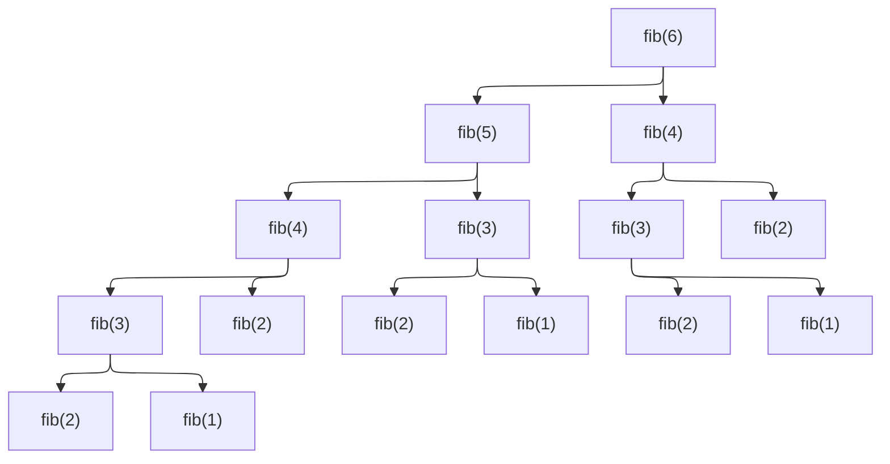
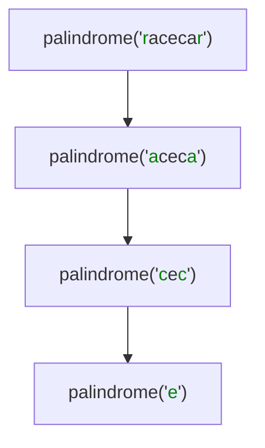

```mdx-code-block
import CodeBlock from '@theme/CodeBlock';
import Tabs from '@theme/Tabs';
import TabItem from '@theme/TabItem';
```

## Recursion
Recursion is a technique where an algorithm solves a problem by:

* Solving smaller instances of the same problem
* Combining their results
* Stopping at a base case

Formally: A recursive algorithm defines the solution in terms of itself on smaller inputs. This mirrors mathematical induction and many problem structures in CS.

We say there’s recursion when a function delegates work to clones
of itself. A recursive algorithm will naturally come to mind for
solving a problem defined in terms of itself. For example, take
the famous Fibonacci sequence.

Using recursion requires creativity for seeing how a problem can be stated in terms of itself.

Recursion is:

* A problem-solving lens
* A bridge between math and code
* The natural language of algorithm design

Algorithm strategies (Divide & Conquer, DP, Backtracking, etc.) are essentially structured ways of using recursion effectively.

Recursive algorithms have base cases, when the input is too small
to be further reduced. Base cases for fib are numbers 1 and 2; for
palindrome, they’re words with one or zero characters.

For example, take
the famous Fibonacci sequence. It starts with two ones, and
each subsequent number is the sum of the two previous numbers:
1, 1, 2, 3, 5, 8, 13, 21, … How do you code a function that returns
the nth Fibonnacci number?
```
function fib(n)
    if n ≤2
        return n
    return fib(n -1 ) + fib(n -2 )
```

<!--```
               [ fib(6) ]
               /        \
              /          \
        [ fib(5) ]    [ fib(4) ]
        /      \        /      \
  [ fib(4) ] [ fib(3) ] [ fib(3) ] [ fib(2) ]
    /    \     /    \     /    \
[ fib(3) ][ fib(2) ][ fib(2) ][ fib(1) ][ fib(2) ][ fib(1) ]
  /    \
[ fib(2) ][ fib(1) ]
```-->


Example: Checking if a word is palindrome3 is checking if the word changes if it’s reversed. But also a word is
palindrome if its first and last characters are equal and the sub-
word between those characters is a palindrome:
```
function palindrome(word)
    if word.length ≤1
        return True
    if word.first_char ≠ word.last_char
        return False
    w ← word.remove_first_and_last_chars
    return palindrome(w)
```
**Checking if "racecar" is palindrome recursively**


**Core components of any recursive algorithm**

Every correct recursive algorithm has:

1. Base case
   * The smallest input that can be solved directly
   * Prevents infinite recursion
2. Recursive case
   * The problem reduced to smaller subproblems
3. Progress toward the base case
   * Each recursive call must move closer to termination

If any of these are missing → the algorithm is incorrect.

**Role in Algorithm Design Strategies**

Many problems are naturally recursive:

* Tree traversal
* Graph exploration
* Divide-and-conquer problems
* Dynamic programming recurrences

Trying to force these into purely iterative logic often:

* Obscures the idea
* Makes correctness harder to reason about

Recursion gives you clarity first, optimization second.

Recursion is the engine behind several major algorithm design paradigms. Each uses recursion differently to manage the "flow" of problem-solving.

1. Divide and Conquer

   Recursion is the heart of the Divide and Conquer strategy. It works by breaking a problem into smaller "sub-problems" that look exactly like the original, solving those, and then combining the results. This strategy splits a problem into independent sub-problems, solves them recursively, and then combines the results.

   Without recursion, divide-and-conquer loses its conceptual simplicity.

   Each recursive call represents one level of decision.

   * How it uses recursion: It creates a "branching" effect where the problem size is reduced significantly at each step (often halved).
   * Pattern:
     * Divide problem into subproblems
     * Solve subproblems recursively
     * Combine results
   * Examples:
     * Sorting: Algorithms like Merge Sort and Quick Sort use recursion to split lists until they are single elements, then stitch them back together in order.
       * Merge Sort: Divides an array until it reaches 1-element subarrays, then merges them back in order.
       * Quick Sort
     * Searching: Binary Search recursively discards half of the data set at each step to find a target in O(logn) time.
       * Binary Search: Discards half of the searchable data at each recursive step.
     * Strassen’s Matrix Multiplication
2. Greedy Algorithms
   * Recursion is optional but often helpful.
   * Example:
     * Activity selection (recursive version)
     * Huffman coding tree construction
   * Greedy logic chooses locally optimal steps; recursion structures the solution.
3. Backtracking

   Backtracking is used for problems where you need to explore all possible configurations or paths to find a solution.

   Recursion models decision trees.
   * Pattern:
     * Choose
     * Explore recursively
     * Undo choice
   * How it uses recursion: It builds a solution incrementally. If the current "path" fails a constraint, the function "returns" (backtracks) to the previous state to try a different path.
   * Examples:
     * N-Queens Problem: Placing queens on a board and backtracking if two queens attack each other.
     * Sudoku Solvers: Filling cells and undoing choices that lead to a dead end.
     * Permutations and combinations
     * Subset generation
4. Dynamic Programming (Top-Down)

   When sub-problems are not independent (they overlap), simple recursion becomes inefficient. Dynamic Programming uses recursion with Memoization.

   * Recursion expresses the recurrence relation.
   * Top-Down DP:
     * Recursive definition
     * Memoization avoids recomputation
   * Even Bottom-Up DP usually starts from a recursive formulation before converting to loops.
   * How it uses recursion: It solves the problem recursively but stores the results of sub-problems in a table (cache). Before a recursive call is made, the function checks if the result is already in the cache.
   * Examples:
     * Fibonacci Sequence: Avoiding the re-calculation of Fib(3) multiple times.Example idea: "To compute f(n), I need f(n-1) and f(n-2)"
     * Knapsack Problem: Finding the optimal combination of items.
5. Graph Algorithms
   * Recursion naturally matches graph traversal.
   * Examples:
     * Depth-First Search (DFS)
     * Topological sorting
     * Finding connected components
   * The call stack acts like an implicit stack data structure.

**When to Use Recursion**

You should consider a recursive approach if:

* The problem can be naturally defined in terms of a smaller version of itself (e.g., a tree node is just a root with smaller trees as children).
* Code readability and maintainability are more critical than absolute peak performance.
* The depth of the recursion is guaranteed to be shallow enough to avoid stack overflow errors.

### Recursive vs. Iterative Comparison

While any recursive algorithm can be written using a loop (iteration) and a stack data structure, recursion is often preferred for its expressiveness.

Recursion:

* Expresses problem structure
* Matches mathematical definitions
* Easier to reason about correctness

Iteration:

* Often more memory-efficient
* Better control over stack usage
* Preferred in performance-critical code

Recursive algorithms are generally simpler and shorter than iterative ones. Compare  recursive and Iteration algorithm for power set
<table><tr><th>Iteration</th><th>Recursive</th></tr><tr><td><pre><code>function power_set(items)
    ps ← Set.new
    ps.add(Set.new)
    for each item in items
        new_ps ← copy(ps)
        for each p in new_ps
            p.add(item)
        ps ← ps + new_ps
    return ps</code></pre></td><td><pre><code>function recursive_power_set(items)
    ps ← copy(items)
    for each e in items
        ps ← ps.remove(e)
        ps ← ps + recursive_power_set(ps)
        ps ← ps.add(e)
    return ps</code></pre></td></tr></table>
This simplicity comes at a price. Recursive algorithms spawn nu-
merous clones of themselves when they run, introducing a compu-
tational overhead. The computer must keep track of unfinished
recursive calls and their partial calculations, requiring more mem-
ory. And extra CPU cycles are spent to switch from a recursive call
to the next and back.

This potential problem can be visualized in recursion trees:
a diagram showing how the algorithm spawns more calls as it
delves deeper in calculations.as we seen recursion trees for calculating Fibonacci numbers and checking palindrome words.

If performance must be maximized, we can avoid this overhead
by rewriting recursive algorithms in a purely iterative form. Doing
so is always possible. It’s a trade: the iterative code generally runs
faster but it’s also more complex and harder to understand.

Key insight: Many iterative algorithms are just optimized recursive algorithms with an explicit stack.
|     |     |     |
| --- | --- | --- |
| Feature	 | Recursion	 | Iteration |
| Code Length	 | Typically shorter and more elegant.	 | Often longer and more "manual." |
| Memory	 | Uses the Call Stack (higher memory overhead).	 | Uses a fixed amount of memory. |
| Performance	 | Can be slower due to function call overhead.	 | Generally faster. |
| Best For	 | Trees, Graphs, and complex branching.	 | Simple linear traversals or counters. |

**Recursion and correctness proofs**

Recursion aligns perfectly with:

* Mathematical induction
* Invariants on subproblems

To prove a recursive algorithm correct:

* Base case is correct
* Assume recursive calls are correct
* Show the combine step is correct

This is why recursion dominates algorithm textbooks.

**Costs and limitations of recursion**

Recursion is powerful but not free:

* Function call overhead
* Stack memory usage
* Risk of stack overflow
* Repeated computation (if no memoization)

Algorithm strategies like Dynamic Programming exist largely to fix naive recursion.
