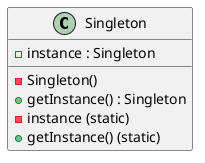
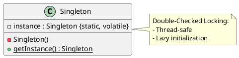
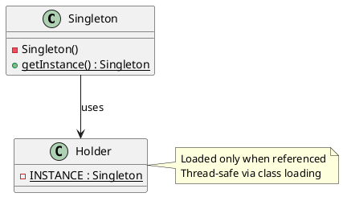
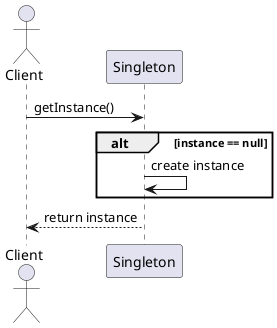

## Overview
A **singleton** is simply a class that is instantiated exactly once. Singletons typically represent either a stateless object such as a function  or a system component that is intrinsically unique.

The **Singleton** pattern ensures that a class has **only one instance** and provides a **global access point** to that instance.

It is commonly used when exactly one object is needed to coordinate actions across a system.

## Intent
* Guarantee a single instance of a class
* Provide controlled global access to that instance

## Also Known As

* Single Instance Pattern

## Motivation (Problem)
In many systems, certain components should exist only once:
* Configuration manager
* Logging service
* Connection pool
* Cache manager

Creating multiple instances of these can lead to:
* Inconsistent state
* Resource conflicts
* Unexpected behavior

The Singleton pattern solves two problems at the same time, violating the Single Responsibility Principle:
1. **Ensure that a class has just a single instance**. 
        - Why would anyone want to control how many instances a class has? The most common reason for this is to control access to some shared resource—for example, a database or a file.
        - Here’s how it works: imagine that you created an object, but after a while decided to create a new one. Instead of receiving a fresh object, you’ll get the one you already created.
        - Note that this behavior is impossible to implement with a regular constructor since a constructor call must always return a new object by design.
2. **Provide a global access point to that instance**. 
        - Remember those global variables that you (all right, me) used to store some essential objects? While they’re very handy, they’re also very unsafe since any code can potentially overwrite the contents of those variables and crash the app.
        - Just like a global variable, the Singleton pattern lets you access some object from anywhere in the program. However, it also protects that instance from being overwritten by other code.
        - There’s another side to this problem: you don’t want the code that solves problem #1 to be scattered all over your program. It’s much better to have it within one class, especially if the rest of your code already depends on it.

Nowadays, the Singleton pattern has become so popular that people may call something a singleton even if it solves just one of the listed problems.


### 1. ❌ Uncontrolled Multiple Instances

Problem: A class is instantiated many times when only one instance is logically needed.

```java
ConfigurationManager c1 = new ConfigurationManager();
ConfigurationManager c2 = new ConfigurationManager();
```

👉 Leads to:

* Duplicate objects
* Wasted memory
* Inconsistent behavior

### 2. ❌ Inconsistent Shared State

Problem: Each instance maintains its own state → system becomes inconsistent.

```java
c1.set("env", "prod");
c2.set("env", "dev"); // conflict
```

👉 No single source of truth

### 3. ❌ Expensive Object Creation

Problem: Some objects are costly to create:

* Database connections
* Thread pools
* Caches
* Configuration loaders

Creating them multiple times:
* Hurts performance
* Consumes resources unnecessarily

### 4. ❌ Lack of Centralized Control

Problem: Object lifecycle is scattered across the system.
* No control over when/how instances are created
* Hard to enforce constraints

### 5. ❌ Global Access Without Structure

Problem: You need a globally accessible object, but using:
* global variables ❌
* static fields ❌

👉 Leads to:
* Poor encapsulation
* Hard-to-maintain code

## Solution
All implementations of the Singleton have these two steps in common:
- Make the default constructor private, to prevent other objects from using the new operator with the Singleton class. 
- Create a static creation method that acts as a constructor. Under the hood, this method calls the private constructor to create an object and saves it in a static field. All following calls to this method return the cached object. 

If your code has access to the Singleton class, then it’s able to call the Singleton’s static method. So whenever that method is called, the same object is always returned.

### ✔ 1. Single Controlled Instance

Singleton ensures:

```java
ConfigurationManager c1 = ConfigurationManager.getInstance();
ConfigurationManager c2 = ConfigurationManager.getInstance();

System.out.println(c1 == c2); // true ✅
```

👉 Only one object exists

### ✔ 2. Controlled Object Creation

```java
private ConfigurationManager() {}
```

👉 Prevents:

```java
new ConfigurationManager(); // ❌ not allowed
```

### ✔ 3. Global Access Point

```java
public static ConfigurationManager getInstance()
```

👉 Accessible from anywhere in the system:

```java
ConfigurationManager.getInstance().get("env");
```

### ✔ 4. Lazy Initialization (Optional)

```java
if (instance == null) {
    instance = new ConfigurationManager();
}
```

👉 Object created **only when needed**

### ✔ 5. Centralized State Management

All components share the same instance:

```java
ConfigurationManager.getInstance().set("env", "prod");
```

👉 Ensures consistency

### ✔ 6. Resource Optimization

* One DB connection pool
* One cache
* One config loader

👉 Saves memory + improves performance

## 🔄 Problem → Solution Mapping

| Problem              | Singleton Solution                  |
| -------------------- | ----------------------------------- |
| Multiple instances   | Single static instance              |
| Inconsistent state   | Shared global instance              |
| Expensive creation   | Reuse one object                    |
| No lifecycle control | Private constructor + static access |
| Unsafe global access | Encapsulated global access          |

## Real-World Analogy

The government is an excellent example of the Singleton pattern. A country can have only one official government. Regardless of the personal identities of the individuals who form governments, the title, “The Government of X”, is a global point of access that identifies the group of people in charge.
Here’s the **Real-World Analogy** section for the **Singleton Design Pattern**, aligned with your structured template.

## Singleton Pattern — Real-World Analogy

### 🎯 Core Idea Reminder

> Only **one instance exists**, and everyone uses that same instance.

### 🏢 Analogy 1: Company CEO

**Scenario**: A company has **one CEO**.

* Employees don’t create new CEOs
* Everyone refers to the **same person**
* Decisions are centralized

**Mapping** to Singleton

| Real World | Singleton          |
| ---------- | ------------------ |
| CEO        | Singleton instance |
| Company    | Application        |
| Employees  | Classes/objects    |
| Access CEO | `getInstance()`    |

👉 You cannot do:

```java
new CEO(); // ❌ not allowed
```

👉 You must do:

```java
CEO.getInstance(); // ✅ same CEO for everyone
```

### Analogy 2: Power Generator in a Building

**Scenario**: A building has **one central power generator**.

* All apartments use it
* Creating multiple generators:

  * Expensive ❌
  * Dangerous ❌
* Must be centrally controlled

**Mapping**

| Real World         | Singleton              |
| ------------------ | ---------------------- |
| Generator          | Singleton object       |
| Electricity usage  | Method calls           |
| Building residents | Application components |

👉 Everyone shares the same resource

### Analogy 3: Operating System Kernel

**Scenario**: A computer has **one OS kernel instance** controlling:

* Memory
* Processes
* Hardware

👉 Multiple kernels running independently would break the system

**Mapping**

| Real World   | Singleton     |
| ------------ | ------------- |
| OS Kernel    | Singleton     |
| Applications | Clients       |
| System calls | Method access |

### 🗂️ Analogy 4: Configuration File Loader

**Scenario**: An application reads a config file:

* Reading it multiple times is slow
* Different copies may diverge

👉 Better:

* Load once
* Share everywhere

#### Java Equivalent

```java id="n6v2ks"
ConfigurationManager config = ConfigurationManager.getInstance();
```

### 🚦 Analogy 5: Traffic Control System

**Scenario**: A city has **one central traffic controller system**:

* Coordinates all signals
* Prevents conflicts

👉 Multiple independent controllers:

* Chaos ❌
* Inconsistency ❌

### Counter-Analogy (When NOT Singleton)

**Bank Accounts**
* You should NOT have one account for everyone
* Each user needs their own instance

👉 This is NOT a Singleton use case

**Key Insight from Analogies**

All good Singleton analogies share:

* **Uniqueness** → only one exists
* **Shared access** → everyone uses it
* **Central control** → consistent behavior

{/* ### 🔑 Final Mental Model

Think:

> “If multiple copies would cause inconsistency, waste, or conflict → Singleton might fit”

If you want next:

* I can give **real production examples (Spring, logging frameworks, DB pools)**
* Or contrast with **analogy for Dependency Injection (very helpful for interviews)** */}

## Identification
### 1. Code-Level Identification (Static Clues)

When reading code, look for these signatures:

**Private Constructor**

```java
private Singleton() {}
```
Prevents external instantiation

**Static Instance Field**

```java
private static Singleton instance;
```
or
```java
private static final Singleton INSTANCE = new Singleton();
```

**Public Static Access Method**

```java
public static Singleton getInstance() {
    return instance;
}
```
or (lazy)
```java
if (instance == null) {
    instance = new Singleton();
}
```

**No Public Constructors**

If you see:

```java
new Singleton(); // ❌ not allowed
```
Then it's NOT a proper Singleton

### 2. Behavioral Identification (Runtime Clues)

Even without reading full code, you can detect Singleton behavior:

* Same object returned every time
* Shared state across different parts of the system
* Global access without passing references

#### Example

```java
Singleton s1 = Singleton.getInstance();
Singleton s2 = Singleton.getInstance();

System.out.println(s1 == s2); // true
```

### 3. Usage Patterns in Codebase

Look for repeated usage like:

```java
Logger.getInstance().log("...");
ConfigManager.getInstance().get("key");
Cache.getInstance().put("k", "v");
```
This chaining is a strong Singleton indicator

### 4. Naming Clues

Classes often hint their intent:

* `Logger`
* `ConfigurationManager`
* `CacheManager`
* `ConnectionPool`
* `Registry`
These are commonly implemented as Singletons

### 5. Architectural Smells (Implicit Singleton)

Sometimes Singleton is used **without being explicit**:

#### Hidden Singleton (Anti-pattern)

```java
class Service {
    private static final Database db = new Database();
}
```
This behaves like a Singleton but:
* No access control
* Hard to test
* Hidden dependency

### 6. Framework-Level Singleton (Important)

In modern Java systems (e.g., Spring):

```java
@Service
public class UserService {
}
```
By default:
* One instance per application
* Managed by container

This is a **managed Singleton**, not manual

### 7. Anti-Patterns to Watch

#### ❌ Global Variable Disguised as Singleton

```java
public static Singleton instance;
```
No encapsulation → dangerous

#### ❌ Multiple Instance Creation Paths

```java
public static Singleton getInstance() { ... }
public Singleton() {} // ❌ breaks singleton
```

### 8. Quick Identification Checklist

Ask these questions:
* Is the constructor private?
* Is there a static instance field?
* Is access provided via a static method?
* Is the same object reused everywhere?
* Is object creation controlled internally?

If **YES to most → it's a Singleton**

### 9. Distinguishing from Similar Concepts

| Pattern            | Difference               |
| ------------------ | ------------------------ |
| Singleton          | One instance globally    |
| Static Class       | No instance at all       |
| Factory            | Creates multiple objects |
| DI Singleton Scope | Managed externally       |

### 10. Real-World Recognition
You are likely seeing a Singleton when:
* A logger is accessed globally
* Config is read once and reused
* A cache is shared across services
* A connection pool is centralized

**Key Insight**

The strongest signal is **controlled instantiation + global access**

Not just: only one object exists, But: you cannot create another even if you try

## Applicability (When to Use)

Use Singleton when:

* Exactly **one instance** is required
* The instance must be **accessible globally**
* You need **lazy initialization** (create only when needed)
* You want **controlled access** to shared resources

Avoid when:

* You need multiple instances later (tight coupling)
* Testing/mocking is important (Singletons make testing harder)
* You are working in highly concurrent/distributed systems without careful design

## Structure


**Key Components**

* **Private constructor** → prevents external instantiation
* **Static instance variable** → holds the single instance
* **Public static method** → provides access to the instance

## Pseudocode

### 🎯 Basic (Lazy Initialization – Not Thread-Safe)

```text
class Singleton

    private static instance : Singleton

    private constructor()

    public static method getInstance() : Singleton
        if instance is null
            instance = new Singleton()
        end if

        return instance
```

### 🔒 Thread-Safe (Synchronized Access)

```text
class Singleton

    private static instance : Singleton

    private constructor()

    public static synchronized method getInstance() : Singleton
        if instance is null
            instance = new Singleton()
        end if

        return instance
```

### ⚡ Double-Checked Locking (Efficient Thread-Safe)

```text
class Singleton

    private static instance : Singleton
    private static lock

    private constructor()

    public static method getInstance() : Singleton
        if instance is null
            acquire lock

            if instance is null
                instance = new Singleton()
            end if

            release lock
        end if

        return instance
```

### 🚀 Eager Initialization

```text
class Singleton

    private static instance : Singleton = new Singleton()

    private constructor()

    public static method getInstance() : Singleton
        return instance
```

### 🏆 Bill Pugh (Initialization-on-Demand Holder)

```text
class Singleton

    private constructor()

    private static class Holder
        static instance : Singleton = new Singleton()

    public static method getInstance() : Singleton
        return Holder.instance
```

### 🛡️ Enum-Based (Conceptual)

```text
enum Singleton

    INSTANCE

    method doSomething()
```

### 🔑 Key Elements in All Variants

* **Private constructor** → prevents external creation
* **Static instance** → shared across application
* **Global access method** → controlled retrieval

### 🧠 Execution Flow (Generic)

```text
Client calls getInstance()

    if instance does not exist
        create instance
    end if

    return existing instance
```

## UML Diagram

### 📌 Class Diagram (Core Structure)


Explanation

* `- instance : Singleton`
  → **private static field** holding the single instance

* `- Singleton()`
  → **private constructor** prevents object creation

* `+ getInstance() : Singleton`
  → **public static method** to access the instance

### ⚡ Enhanced UML (Thread-Safe Version)



### 🏆 Bill Pugh (Holder Pattern UML)



### 🔄 Sequence Diagram (How getInstance Works)


## Basic Implementation 
There are many common ways to implement singletons. All are based on
keeping the constructor private and exporting a public static member to provide
access to the sole instance.

How to Implement
1. Add a private static field to the class for storing the singleton instance.
2. Declare a public static creation method for getting the singleton instance.
3. Implement “lazy initialization” inside the static method. It should create a new object on its first call and put it into the staticfield. The method should always return that instance on all subsequent calls.
4. Make the constructor of the class private. The static method of the class will still be able to call the constructor, but not the otherobjects.
5. Go over the client code and replace all direct calls to the singleton’s constructor with calls to its static creation method.

### 1. Simple Singleton (Not Thread-Safe)

```java
public class Singleton {

    private static Singleton instance;

    private Singleton() {
        // private constructor prevents instantiation
    }

    public static Singleton getInstance() {
        if (instance == null) {
            instance = new Singleton(); // NOT thread-safe
        }
        return instance;
    }
}
```

### 2. Thread-Safe Singleton (Synchronized Method)

```java
public class Singleton {

    private static Singleton instance;

    private Singleton() {}

    public static synchronized Singleton getInstance() {
        if (instance == null) {
            instance = new Singleton();
        }
        return instance;
    }
}
```
Simple but **slow** due to synchronization on every call.

### 3. Double-Checked Locking (Recommended)

```java
public class Singleton {

    private static volatile Singleton instance;

    private Singleton() {}

    public static Singleton getInstance() {
        if (instance == null) {
            synchronized (Singleton.class) {
                if (instance == null) {
                    instance = new Singleton();
                }
            }
        }
        return instance;
    }
}
```
Best balance between **performance + thread safety**

### 4. Eager Initialization
There are two common ways to implement Eager Initialization singletons. Both are based on
keeping the constructor private and exporting a public static member to provide
access to the sole instance. In one approach, the member is a final field:
```java
public class Singleton {
    // Singleton with public final field
    public static final Singleton INSTANCE = new Singleton();

    private Singleton() {}
}
```
The private constructor is called only once, to initialize the public static final
field Singleton.INSTANCE. The lack of a public or protected constructor guarantees a
“monoelSingleton” universe: exactly one Singleton instance will exist once the Singleton
class is initialized—no more, no less. Nothing that a client does can change this,
with one caveat: a privileged client can invoke the private constructor reflectively  with the aid of the `AccessibleObject.setAccessible` method. If you
need to defend against this attack, modify the constructor to make it throw an
exception if it’s asked to create a second instance.

The main advantage of the public field approach is that the API makes it clear
that the class is a singleton: the public static field is final, so it will always contain
the same object reference. The second advantage is that it’s simpler.

In the second approach to implementing singletons, the public member is a
static factory method
```java
public class Singleton {

    private static final Singleton instance = new Singleton();

    private Singleton() {}

    public static Singleton getInstance() {
        return instance;
    }
}
```
All calls to Singleton.getInstance return the same object reference, and no other
Singleton instance will ever be created (with the same caveat mentioned earlier)

**advantage**
1. One advantage of the static factory approach is that it gives you the flexibility to change your mind about whether the class is a singleton without changing its API. The factory method returns the sole instance, but it could be modified to
return, say, a separate instance for each thread that invokes it. 
2. A second advantage is that you can write a generic singleton factory if your application requires it.
3. A final advantage of using a static factory is that a method reference can
be used as a supplier, for example `Singleton::instance` is a `Supplier<Singleton>`.
Unless one of these advantages is relevant, the public field approach is preferable.

To make a singleton class that uses either of these approaches serializable, it is not sufficient merely to add implements `Serializable` to its
declaration. To maintain the singleton guarantee, 
1. declare all instance fields transient and 
2. provide a readResolve method. 

Otherwise, each time a serialized instance is deserialized, a new instance will be created, leading, in the case of our example, to spurious Singleton sightings. To prevent this from happening, add this `readResolve` method to the `Singleton` class:
```java
// readResolve method to preserve singleton property
private Object readResolve() {
// Return the one true Singleton and let the garbage collector
// take care of the Singleton impersonator.
return INSTANCE;
}
```

This methods are Thread-safe but **no lazy loading**

### 5. Bill Pugh Singleton (Best Practice)

```java
public class Singleton {

    private Singleton() {}

    private static class Holder {
        private static final Singleton INSTANCE = new Singleton();
    }

    public static Singleton getInstance() {
        return Holder.INSTANCE;
    }
}
```
Uses class loading → **thread-safe + lazy + fast**

### 6. Enum Singleton (Safest)
A another way to implement a singleton is to declare a single-element enum:
```java
public enum Singleton {
    INSTANCE;

    public void doSomething() {
        System.out.println("Doing work...");
    }
}
```

Usage:

```java
Singleton.INSTANCE.doSomething();
```
This approach is similar to the public field approach, but:
1. it is more concise,
2. provides the serialization machinery for free, and
3. provides an ironclad guarantee against multiple instantiation, even in the face of sophisticated serialization or reflection attacks. 

This approach may feel a bit unnatural, but **a single-element enum type is often the best way to implement a singleton**. Note that you can’t
use this approach if your singleton must extend a superclass other than `Enum` (though you can declare an enum to implement interfaces)

Protects against:

* Serialization issues
* Reflection attacks

### Quick Guidance

| Variant        | Use Case                                 |
| -------------- | ---------------------------------------- |
| Simple         | Single-threaded apps only                |
| Synchronized   | Small apps, simplicity                   |
| Double-Checked | General-purpose                          |
| Eager          | Always needed instance                   |
| Bill Pugh      | ✅ Best default choice                    |
| Enum           | ✅ Safest (recommended by Effective Java) |


## Real-World Examples
* Logging system (single log writer)
* Database connection pool
* Configuration manager (reads config once)
* OS kernel components (device manager)

## Sequence Flow
1. Client requests instance
2. Singleton checks if instance exists
3. If not → creates it
4. Returns the same instance every time

## Pros
* You can be sure that a class has only a single instance. 
* You gain a global access point to that instance. 
* The singleton object is initialized only when it’s requested for the first time.
* Controlled access to a single instance
* Saves memory/resources
* Lazy initialization possible
* Centralized management

## Cons
* Hidden dependencies (acts like global variable)
* Not inherently thread-safe
* Violates Single Responsibility Principle (often manages its lifecycle + logic): The pattern solves two problems at the time.
* The Singleton pattern can mask bad design, for instance, when the components of the program know too much about each other.
* The pattern requires special treatment in a multithreaded environment so that multiple threads won’t create a singleton object several times.

### Hard to test (global state)
Making a class a singleton can
make it difficult to test its clients because it’s impossible to substitute a mock
implementation for a singleton unless it implements an interface that serves as its
type.

Many test frameworks rely on inheritance when producing mock objects. Since the constructor of the singleton class is private and overriding static methods is impossible in most languages, you will need to think of a creative way to mock the singleton. Or just don’t write the tests. Or don’t use the Singleton pattern.


**Testing Challenges**
* Hard to mock
* State persists between tests
* Requires reset mechanisms or dependency injection workaround


## Comparison

### Singleton vs Dependency Injection (DI)

#### Overview

* **Singleton** → Controls *how many instances exist* (exactly one)
* **Dependency Injection (DI)** → Controls *how objects get their dependencies*
They solve **different problems**, but often overlap in real systems.

#### Core Idea Difference

| Aspect   | Singleton              | Dependency Injection                |
| -------- | ---------------------- | ----------------------------------- |
| Purpose  | Ensure single instance | Decouple object creation from usage |
| Focus    | Lifecycle control      | Dependency management               |
| Scope    | Global                 | Contextual / configurable           |
| Coupling | Tight                  | Loose                               |

#### Conceptual Analogy

* **Singleton** = “There must be only one CEO”
* **DI** = “Employees don’t hire their own tools — they receive them”

### 1. Singleton Pattern

#### Intent

Ensure a class has only one instance and provide global access.

#### Java Implementation (Thread-Safe)

```java
public class Logger {

    private static volatile Logger instance;

    private Logger() {}

    public static Logger getInstance() {
        if (instance == null) {
            synchronized (Logger.class) {
                if (instance == null) {
                    instance = new Logger();
                }
            }
        }
        return instance;
    }

    public void log(String msg) {
        System.out.println(msg);
    }
}
```

#### Usage

```java
Logger logger = Logger.getInstance();
logger.log("Hello");
```

#### Problems

* Global state
* Hard to test (can’t mock easily)
* Tight coupling

### 2. Dependency Injection (DI)

#### Intent

Provide dependencies to a class instead of letting it create them.

#### Without DI (Bad Design)

```java
public class UserService {

    private Logger logger = Logger.getInstance(); // tightly coupled

    public void process() {
        logger.log("Processing...");
    }
}
```

#### With DI (Good Design)

```java
public class UserService {

    private Logger logger;

    public UserService(Logger logger) {
        this.logger = logger;
    }

    public void process() {
        logger.log("Processing...");
    }
}
```

#### Usage

```java
Logger logger = new Logger(); // could still be singleton if needed
UserService service = new UserService(logger);
service.process();
```

#### Key Insight
DI does NOT prevent Singleton
👉 DI can **manage Singleton instances cleanly**

### Side-by-Side Comparison

#### Object Creation

##### Singleton

```java
Logger logger = Logger.getInstance();
```

##### DI

```java
Logger logger = new Logger();
UserService service = new UserService(logger);
```

#### Coupling

##### Singleton

```java
class A {
    Logger logger = Logger.getInstance(); // hard-coded dependency
}
```

##### DI

```java
class A {
    Logger logger;

    A(Logger logger) {
        this.logger = logger; // flexible
    }
}
```

#### Testing

##### Singleton (Hard)

```java
// cannot easily replace Logger
```

##### DI (Easy)

```java
Logger mockLogger = new MockLogger();
UserService service = new UserService(mockLogger);
```

### Combining Both (Best Practice)

You often use **Singleton + DI together**

##### Example with DI Container (Spring-style concept)

```java
@Component
public class Logger {
}
```

```java
@Service
public class UserService {

    private final Logger logger;

    public UserService(Logger logger) {
        this.logger = logger;
    }
}
```
The DI container:

* Creates **one instance** (Singleton scope)
* Injects it everywhere

### When to Use What

#### Use Singleton when:

* You truly need one instance
* Resource sharing is critical (e.g., cache, config)

#### Use DI when:

* You want loose coupling
* You need testability
* You build scalable systems

### Decision Guide

```
Do you need only one instance?
    YES → Singleton (maybe managed by DI)
    NO  → Use normal objects

Do you want flexibility/testability?
    YES → Use DI
    NO  → Singleton might be acceptable
```

### Common Mistake

❌ Using Singleton as a shortcut instead of proper design

```java
// BAD: hiding dependency
class OrderService {
    private PaymentService payment = PaymentService.getInstance();
}
```

✔ Better:

```java
class OrderService {
    private PaymentService payment;

    public OrderService(PaymentService payment) {
        this.payment = payment;
    }
}
```

### Pros & Cons Summary

#### Singleton

##### Pros

* Easy access
* Memory efficient

##### Cons

* Global state
* Hard to test
* Tight coupling

#### Dependency Injection

##### Pros

* Loose coupling
* Testable
* Flexible
* Scalable

##### Cons

* More setup
* Requires discipline or framework

### Real-World Insight (Important)

Modern systems (Spring, Micronaut, Quarkus):
**Do NOT use manual Singleton**
👉 Use **DI container with Singleton scope**

### Final Takeaway

* Singleton = *lifecycle control*
* DI = *design philosophy*
If you rely only on Singleton, your design becomes rigid
👉 If you use DI, you can still have Singleton — but **cleanly managed**


## Thread Safety 
### multithreading race condition
Let’s simulate the **race condition step-by-step** using the classic *non-thread-safe lazy Singleton*.

#### Setup (Problematic Code)

```java
public class Singleton {

    private static Singleton instance;

    private Singleton() {}

    public static Singleton getInstance() {
        if (instance == null) {          // (1)
            instance = new Singleton();  // (2)
        }
        return instance;                 // (3)
    }
}
```

#### Scenario: Two Threads

* Thread **T1**
* Thread **T2**

Both call:

```java
Singleton.getInstance();
```

#### Step-by-Step Race Condition

#### Step 1 — Initial State

```text
instance = null
```

#### Step 2 — Thread T1 enters

```text
T1 → checks (instance == null) → TRUE
```
- T1 is about to create instance...
- But gets **paused (context switch)**

#### Step 3 — Thread T2 enters

```text
T2 → checks (instance == null) → TRUE
```
Because T1 hasn’t assigned yet

#### Step 4 — T2 creates instance

```text
T2 → instance = new Singleton()  // Object A
```
Now:
```text
instance → Object A
```

#### Step 5 — Context switches back to T1

T1 resumes execution **from where it left off**

👉 It does NOT re-check condition!

#### Step 6 — T1 creates another instance

```text
T1 → instance = new Singleton()  // Object B
```
Now:
```text
instance → Object B
```

#### Final Result

* Object A created by T2 → LOST (garbage)
* Object B created by T1 → final instance
* **Two objects were created ❌ Singleton broken**

#### Timeline Visualization

```text
Time →
----------------------------------------------------

T1:  check null  ----------- create B --------
T2:         check null → create A -----

Result:
- A created
- B created
- Only B survives
```

**Why This Happens**

The issue is:

```java
if (instance == null)
```
This check is:
* NOT atomic
* NOT synchronized

So multiple threads:

* Pass the check simultaneously
* Execute creation independently

Even Worse Case (Partially Constructed Object)

In some JVM scenarios (without `volatile`):

```text
T1 creates object → assigns reference BEFORE fully initializing
T2 reads instance → gets HALF-CONSTRUCTED object 😱
```

Leads to:
* Null fields
* Undefined behavior


**Key Insight**

> The bug is NOT in object creation
> The bug is in **unsynchronized access to shared state**


{/* I can:

* Simulate this with a **real multithreaded Java program (Runnable + Thread)**
* Show **JVM instruction reordering causing broken Singleton**
* Or convert this into a **visual diagram (timeline + memory model)** */}

### Thread Safety Variants
#### Fix 1 — Synchronized Method

```java
public static synchronized Singleton getInstance() {
    if (instance == null) {
        instance = new Singleton();
    }
    return instance;
}
```

👉 Only one thread enters at a time

#### Fix 2 — Double-Checked Locking

```java
private static volatile Singleton instance;

public static Singleton getInstance() {
    if (instance == null) {
        synchronized (Singleton.class) {
            if (instance == null) {
                instance = new Singleton();
            }
        }
    }
    return instance;
}
```
Prevents:
* Multiple creations
* Reordering issues

#### Fix 3 — Bill Pugh (Best Practice)

```java
private static class Holder {
    private static final Singleton INSTANCE = new Singleton();
}

public static Singleton getInstance() {
    return Holder.INSTANCE;
}
```
Uses JVM class loading → inherently thread-safe

| Variant                | Thread Safe | Notes              |
| ---------------------- | ----------- | ------------------ |
| Lazy Initialization    | ❌           | Basic, unsafe      |
| Eager Initialization   | ✅           | Created at startup |
| Double-Checked Locking | ✅           | Efficient          |
| Static Initialization  | ✅           | Language-dependent |

## Applicability(When to Use)
Core Rule: Use Singleton **only when exactly one instance is logically required** and must be **shared across the system**.

- **Use the Singleton pattern when a class in your program should have just a single instance available to all clients; for example, a single database object shared by different parts of the program**.

The Singleton pattern disables all other means of creating objects of a class except for the special creation method. This method either creates a new object or returns an existing one if it has already been created.

- **Use the Singleton pattern when you need stricter control over global variables**.

Unlike global variables, the Singleton pattern guarantees that there’s just one instance of a class. Nothing, except for the Singleton class itself, can replace the cached instance.

Note that you can always adjust this limitation and allow creating any number of Singleton instances. The only piece of code that needs changing is the body of the getInstance method.

### ✅ Appropriate Use Cases

#### 1. ✔ Centralized Configuration Management

##### Why?

* Configuration should be **consistent**
* Loaded once, reused everywhere

##### Example

```java id="1r5l8o"
ConfigurationManager config = ConfigurationManager.getInstance();
String env = config.get("env");
```

#### 2. ✔ Logging Service

##### Why?

* Multiple loggers → inconsistent output
* Single logger → unified logging

```java id="6vyy0q"
Logger logger = Logger.getInstance();
logger.log("Application started");
```

#### 3. ✔ Caching System

##### Why?

* Cache must be shared across components
* Multiple caches → duplicated data

```java id="p6bgd6"
Cache cache = Cache.getInstance();
cache.put("user:1", user);
```

#### 4. ✔ Connection Pool

##### Why?

* Database connections are expensive
* Pool should be centralized

```java id="buhblz"
ConnectionPool pool = ConnectionPool.getInstance();
Connection conn = pool.getConnection();
```

#### 5. ✔ Hardware / Device Access

##### Why?

* Only one controller should manage a device
* Prevent conflicting operations

Examples:

* Printer manager
* GPU controller
* File system manager

#### 6. ✔ Application-Wide Services

Used when a service is:

* Stateless or shared
* Needed everywhere

Examples:

* Metrics collector
* Feature flag manager
* Event dispatcher (sometimes)
## When NOT to Use Singleton

* When scalability matters
* When you need multiple environments (e.g., testing vs production)
* When dependency injection is available (preferred in modern architectures)

### When Multiple Instances Might Be Needed Later

```java id="j2z5r4"
// today: one DB
// tomorrow: multiple DBs → Singleton becomes a problem
```

### When Testability Is Important

Singletons:

* Hard to mock
* Share state across tests

👉 Prefer Dependency Injection

### When It Becomes Global State

```java id="ybxxd3"
Singleton.getInstance().setUser("admin"); // hidden side effects
```

👉 Leads to:

* Tight coupling
* Debugging nightmares

### When In Scalable / Distributed Systems

* Microservices
* Cloud-native apps

👉 “One instance” may not make sense across nodes

### Decision Checklist

Ask yourself:

```text
Is there exactly one logical instance?
    NO → ❌ Do not use Singleton

Does the object represent a shared resource?
    NO → ❌ Avoid Singleton

Do multiple instances cause inconsistency or waste?
    YES → ✅ Consider Singleton

Do you need global access?
    YES → ✅ Singleton may fit

Do you need testability/flexibility?
    YES → ⚠ Prefer Dependency Injection
```
## Best Practices

* Prefer **dependency injection** over Singleton when possible
* If using Singleton:
  * Make it **thread-safe**
  * Keep it **stateless if possible**
  * Avoid heavy logic inside it
* Document clearly that it is a Singleton

## Common Pitfalls

* Forgetting thread safety
* Breaking singleton via:

  * Serialization
  * Reflection (in some languages)
  * Copying/cloning
* Overusing Singleton (turns into global state anti-pattern)

## Real-World Examples
Here are **real production examples** of how the **Singleton concept is used in practice**, especially in Java ecosystems. I’ll show how each system uses Singleton **and how it’s actually implemented (often via DI instead of manual Singleton)**.

### Spring Framework (Default Bean Scope)

In the Spring Framework:

* Beans are **Singleton by default**
* Only **one instance per ApplicationContext**


```java id="qv3i5p"
@Service
public class UserService {

    public void process() {
        System.out.println("Processing...");
    }
}
```
Usage

```java id="2q3r7m"
@Autowired
private UserService userService;
```
What Spring Does Internally

* Creates **one instance**
* Stores it in a container (Singleton registry)
* Injects the same instance everywhere

Equivalent to:

```java id="r8j2l9"
UserService s1 = context.getBean(UserService.class);
UserService s2 = context.getBean(UserService.class);

System.out.println(s1 == s2); // true
```

Why This Is Better Than Manual Singleton

* No static methods
* Easy testing (can mock)
* Lifecycle managed

### Logging Frameworks(Log4j / SLF4J)

```java id="n2y6vl"
import org.slf4j.Logger;
import org.slf4j.LoggerFactory;

public class App {
    private static final Logger logger =
        LoggerFactory.getLogger(App.class);

    public void run() {
        logger.info("Application started");
    }
}
```
What Happens Internally

* Logger instances are **cached and reused**
* Same logger returned for same class name

👉 Conceptually:

```java id="qrbwuy"
Logger l1 = LoggerFactory.getLogger("App");
Logger l2 = LoggerFactory.getLogger("App");

System.out.println(l1 == l2); // true
```

Why Singleton Here?

* Logging must be **centralized**
* Avoid multiple writers/resources
* Maintain consistent configuration

### Database Connection Pools(HikariCP)
**Usage**

```java id="xg5ypl"
HikariDataSource dataSource = new HikariDataSource();
Connection conn = dataSource.getConnection();
```

In Real Systems (Spring Boot)

```java id="2u4sre"
@Autowired
private DataSource dataSource;
```

👉 Only **one pool instance exists**

Why Singleton?

* DB connections are **expensive**
* Pool must be:
  * Shared
  * Managed centrally
  * Thread-safe

👉 Multiple pools = ❌ resource exhaustion

### Java Runtime (JVM Internals)

```java[titlre="Java Runtime Singleton"]

public final class Runtime {
    private static final Runtime currentRuntime = new Runtime();

    private static Version version;

    /**
     * Returns the runtime object associated with the current Java application.
     * Most of the methods of class {@code Runtime} are instance
     * methods and must be invoked with respect to the current runtime object.
     *
     * @return  the {@code Runtime} object associated with the current
     *          Java application.
     */
    public static Runtime getRuntime() {
        return currentRuntime;
    }

    /** Don't let anyone else instantiate this class */
    private Runtime() {}
```
https://github.com/openjdk/jdk/blob/master/src/java.base/share/classes/java/lang/Runtime.java#L136

**Usage**

```java id="j0yq9z"
Runtime runtime = Runtime.getRuntime();
```

**Characteristics**

* Only one Runtime instance per JVM
* Provides:

  * Memory info
  * Process execution
  * GC interaction

👉 Classic **true Singleton**

### Caching Systems
Example: Caffeine

**Usage**

```java id="4vgh8n"
Cache<String, String> cache = Caffeine.newBuilder()
    .maximumSize(100)
    .build();
```

In Real Apps

* Cache is usually:

  * Created once
  * Shared across services

👉 Often managed as Singleton via DI

### Metrics / Monitoring Systems
Example: Micrometer

**Usage**

```java id="6yav8c"
@Autowired
private MeterRegistry registry;
```
Why Singleton?
* Metrics must be:
  * Aggregated globally
  * Consistent across system

**Key Observation**

In Real Production: You rarely see this:

```java id="3a5qcz"
MyService.getInstance(); // ❌ manual Singleton
```
Instead, you see:
```java id="c3r4bo"
@Autowired
private MyService myService;
```
Singleton is:
* Managed by container
* Not hardcoded

**Pattern Evolution in Industry**

| Old Style        | Modern Style         |
| ---------------- | -------------------- |
| Manual Singleton | DI-managed Singleton |
| Static access    | Injected dependency  |
| Hard to test     | Easy to test         |
| Global state     | Controlled scope     |

Singleton still exists everywhere in production, But it's usually **hidden inside frameworks**, not manually implemented.


### Singleton containers(Single Container pattern)
Sometimes it might be useful to define a container that is only started once for several test classes. There is no special support for this use case provided by the Testcontainers extension. Instead this can be implemented using the following pattern:
```java
abstract class AbstractContainerBaseTest {

    static final MySQLContainer MY_SQL_CONTAINER;

    static {
        MY_SQL_CONTAINER = new MySQLContainer();
        MY_SQL_CONTAINER.start();
    }
}
```
```java
class FirstTest extends AbstractContainerBaseTest {

    @Test
    void someTestMethod() {
        String url = MY_SQL_CONTAINER.getJdbcUrl();

        // create a connection and run test as normal
    }
}
```
The singleton container is started only once when the base class is loaded. The container can then be used by all inheriting test classes.

https://java.testcontainers.org/test_framework_integration/manual_lifecycle_control/#singleton-containers
## Refactoring to Singleton

**Goal**: Convert a class that allows **multiple instances** into one that guarantees **a single shared instance**.


### 1. Before Refactoring (Multiple Instances)

Problem: Clients can freely create many objects → inconsistent state, wasted resources.

```java id="8j8s9n"
public class ConfigurationManager {

    public ConfigurationManager() {
        System.out.println("New ConfigurationManager created");
    }

    public String get(String key) {
        return "value-of-" + key;
    }
}
```

#### Usage

```java id="l9g3bc"
ConfigurationManager c1 = new ConfigurationManager();
ConfigurationManager c2 = new ConfigurationManager();

System.out.println(c1 == c2); // false ❌ (different instances)
```

### 2. Step-by-Step Refactoring

#### Step 1: Make Constructor Private

```java id="0n1txq"
public class ConfigurationManager {

    private ConfigurationManager() {}

}
```

👉 Prevents external instantiation

#### Step 2: Add Static Instance Field

```java id="z6ph6y"
private static ConfigurationManager instance;
```

#### Step 3: Provide Global Access Method

```java id="6mfw8o"
public static ConfigurationManager getInstance() {
    if (instance == null) {
        instance = new ConfigurationManager();
    }
    return instance;
}
```

### 3. After Refactoring (Singleton)

```java id="8w8q2t"
public class ConfigurationManager {

    private static ConfigurationManager instance;

    private ConfigurationManager() {
        System.out.println("Singleton instance created");
    }

    public static ConfigurationManager getInstance() {
        if (instance == null) {
            instance = new ConfigurationManager();
        }
        return instance;
    }

    public String get(String key) {
        return "value-of-" + key;
    }
}
```

### 4. Updated Usage

```java id="z7s2xp"
ConfigurationManager c1 = ConfigurationManager.getInstance();
ConfigurationManager c2 = ConfigurationManager.getInstance();

System.out.println(c1 == c2); // true ✅ (same instance)
```

### 5. Thread-Safe Refactoring (Improved Version)

```java id="v6t8ah"
public class ConfigurationManager {

    private static volatile ConfigurationManager instance;

    private ConfigurationManager() {}

    public static ConfigurationManager getInstance() {
        if (instance == null) {
            synchronized (ConfigurationManager.class) {
                if (instance == null) {
                    instance = new ConfigurationManager();
                }
            }
        }
        return instance;
    }
}
```

### 6. Safer Refactoring (Best Practice – Bill Pugh)

```java id="9q3mxt"
public class ConfigurationManager {

    private ConfigurationManager() {}

    private static class Holder {
        private static final ConfigurationManager INSTANCE = new ConfigurationManager();
    }

    public static ConfigurationManager getInstance() {
        return Holder.INSTANCE;
    }
}
```

### 7. Refactoring Impact

#### Before

* Multiple instances
* Hard to control lifecycle
* Possible inconsistent state

#### After

* Single shared instance
* Centralized access
* Controlled creation

### 8. Side Effects (Be Careful)

Refactoring to Singleton introduces:

* ❌ Global state
* ❌ Harder testing
* ❌ Hidden dependencies

### 9. When This Refactoring Makes Sense

Use it when:

* The class represents a **shared resource**
* Only one instance is logically valid (e.g., config, logger)

### 10. When NOT to Refactor

Avoid if:
* You may need multiple instances later
* You want clean testability (prefer DI)
* The class holds mutable state across features

**Key Insight**

- Refactoring to Singleton is easy
- Refactoring *away* from Singleton is hard

If you want next:

* I can show **refactoring from Singleton → Dependency Injection (very important in real systems)**
* Or apply this refactoring to a **real service (like Logger, Cache, DB connection)** step by step


## Related Patterns

* **Factory Method** → can create Singleton instances
* **Builder** → constructs complex objects (can use Singleton internally)
* **Dependency Injection** → often replaces Singleton in modern systems
* **Flyweight** → shares multiple similar instances


## Summary

The Singleton pattern is simple but powerful—and dangerous if misused.
Use it when you truly need **exactly one shared instance**, not just for convenience.

{/* If you want, I can:

* Compare Singleton vs Dependency Injection (very important in real systems)
* Show how Singleton breaks in multithreading step-by-step
* Refactor a real project (like your ITAM system) to remove or introduce Singleton correctly */}
